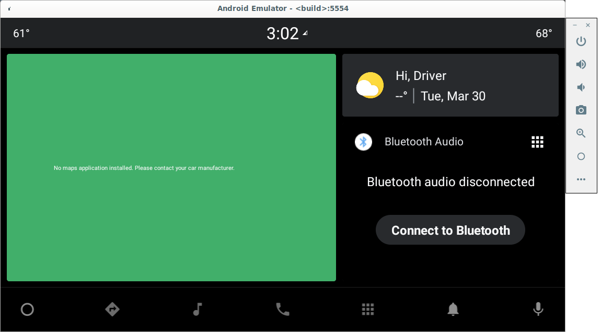
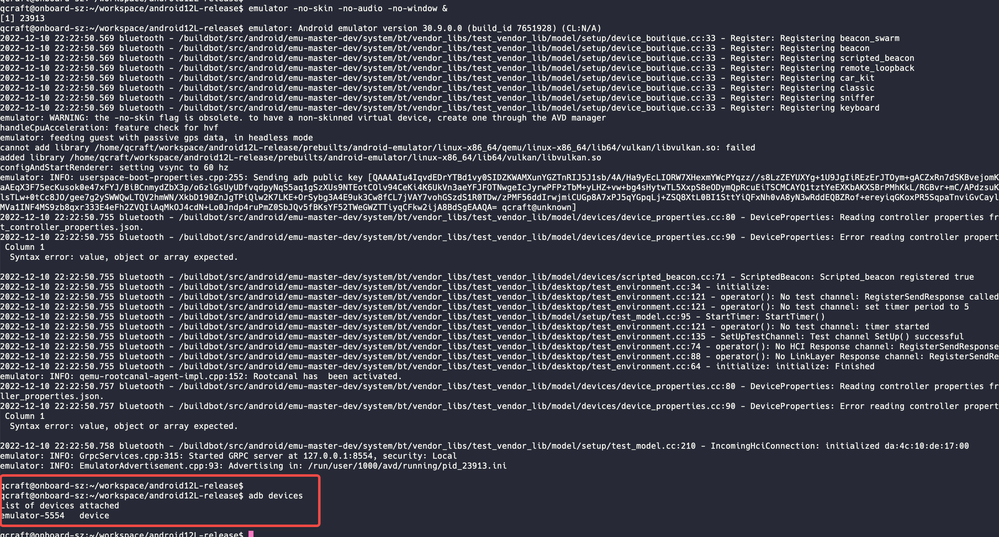
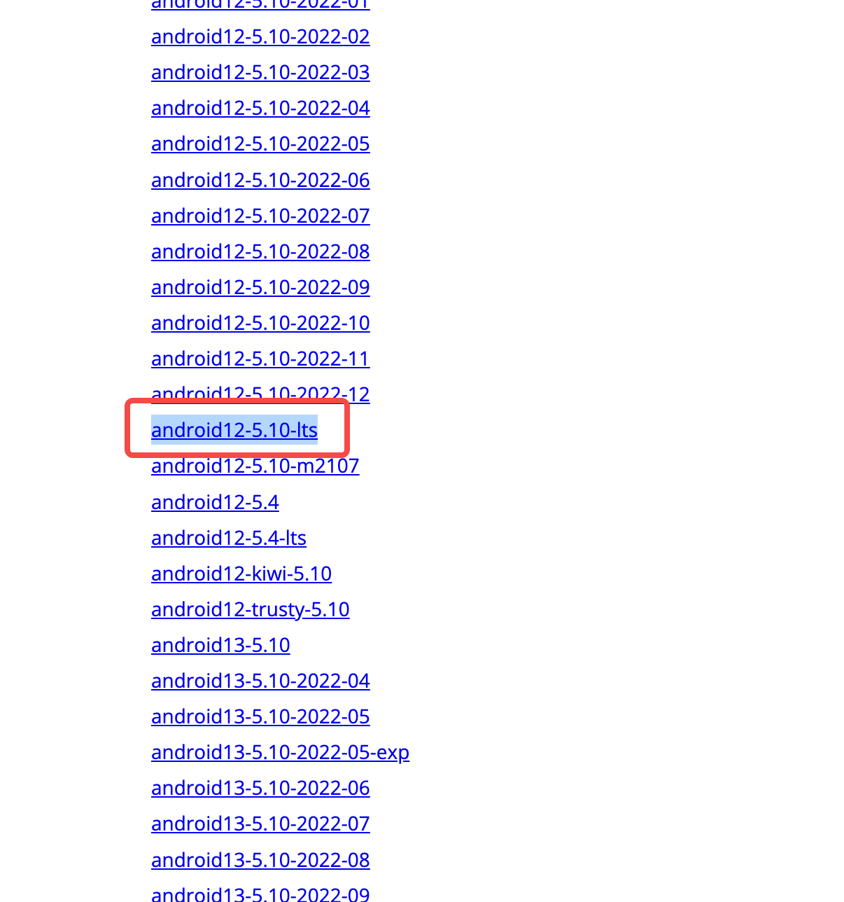
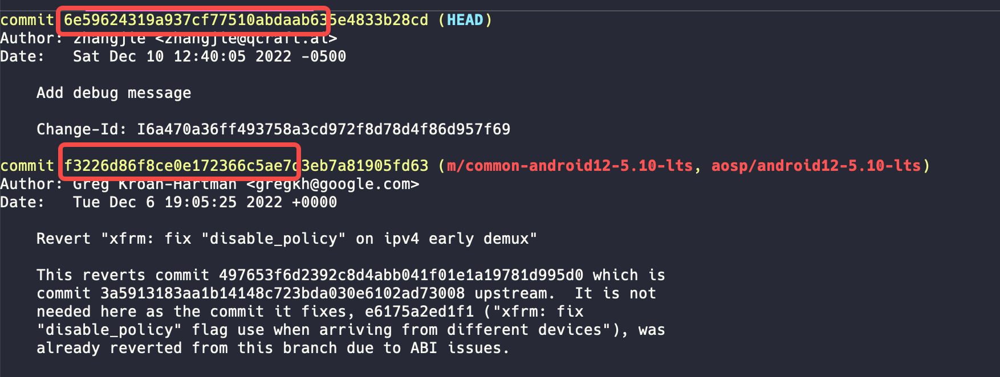
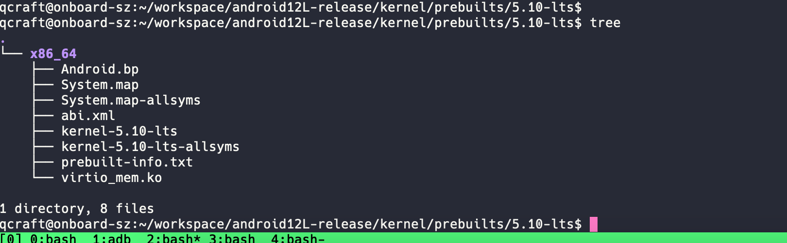
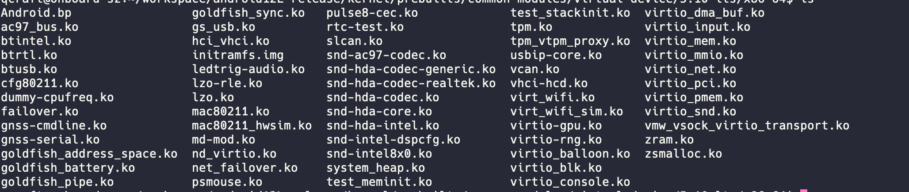
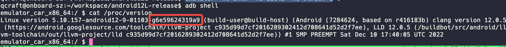

自从2022年1月份辞去了Android系统的工作从事自动驾驶行业以来, 已经接近1年了, 在这一年间基本没接触过Android系统的源代码了, 但是Android的设计思想还是在的, 特别是在复杂的自动驾驶系统里面, 很多好的设计和架构都是如出一辙, 所以在好学心的驱使下, 还是打算把Android的aosp源代码给下载下来研究研究, 毕竟Android也是在不停演进, 站在巨人的肩膀上也可以有更多的视野

但是有个问题, 光看源代码可能远远不能满足我的需求, 但是手头上已经没有Android的开发设备了(都换成了Apple设备), 于是就开始倒腾模拟器了, 毕竟模拟器环境搭建好之后开发效率还是挺高的, 话不多说行动起来

Android源代码是通过repo管理的, 一个repo仓库管理了N多了git仓, 首先是环境搭建, 我这边是基于一台联想工作站, 12代i7给Android预留了500G硬盘, 32G内存, 安装的ubuntu 1804系统

## 源代码环境搭建

### 代码管理工具

可以参考这个链接来下载repo:

[https://source.android.com/docs/setup/download](https://source.android.com/docs/setup/download)

但是我们下载Android12的代码需要用到一个`--partial-clone` 的参数, 使用`apt install`可能会有版本兼容问题, 建议使用下面命令来下载`repo`

```bash
mkdir ~/bin
curl -o ~/bin/repo https://storage.googleapis.com/git-repo-downloads/repo
chmod a+x ~/bin/repo
export PATH=$PATH:~/bin/
```

### 编译依赖库和工具

编译AOSP的源代码需要依赖一堆库和工具, 可以参考下面链接:

[https://source.android.com/docs/setup/start/initializing](https://source.android.com/docs/setup/start/initializing)

我这里使用ubuntu 18.04

```bash
sudo apt-get install git-core gnupg flex bison build-essential zip curl zlib1g-dev gcc-multilib g++-multilib libc6-dev-i386 libncurses5 lib32ncurses5-dev x11proto-core-dev libx11-dev lib32z1-dev libgl1-mesa-dev libxml2-utils xsltproc unzip fontconfig
```

Android的编译命令和一些入门的命令工具可以参考下面的链接:

[https://source.android.com/docs/setup/build/building](https://source.android.com/docs/setup/build/building)

### 下载/编译/运行

这里我尝试了官方给的一个例子里面的版本, 是Android12的分支:

```bash
ANDROID_BRANCH="android12L-release"

REPO_URL="https://android.googlesource.com/platform/manifest"

mkdir $ANDROID_BRANCH && cd $ANDROID_BRANCH && repo init -u $REPO_URL -b
$ANDROID_BRANCH --partial-clone &&  repo sync -c -j8
```

这里下载代码需要很长的时间, 大概会占用160G左右的空间

编译AVD(Android Virtual Device)镜像

```bash
. build/envsetup.sh && lunch sdk_car_x86_64-userdebug && m -j32
```

我们编译的是sdk_car_x86_64-userdebug

1. 首先这是一个for car的版本, 会包含一些车机相关的元素, 后面有机会可以研究一下, 以前也没弄过Android的车机, 都聚焦在Android手持设备上
2. 这是一个x86_64的版本, 为了一些性能考虑吧, 因为Android的模拟器是基于qemu的, 而且我的开发环境本来就是x86_64的系统, 如果用arm的话性能会差点, 所以用x86_64
3. userdebug的版本, 其实自己开发使用也可以用eng版本可能更方便点, release版本的话可能会有些开发限制, 当然了我们可以自己去编译

OK, 经过漫长的编译, 最终可以通过执行`emulator` 命令来启动模拟器:



这张图其实是从官网下载下来的, 因为我运行的时候是失败了, 报了一些qt的错误, 也没有去折腾, 后来索性不去看界面了, 使用下面的命令来启动

```bash
emulator -no-skin -no-audio -no-window &
```



可以通过`adb device`查看当前设备, `adb shell`进入设备的控制台进行调试了, 至于界面的话, 可以采用`vysor`工具来查看, 非常简单, 去百度或者google就行了

OK, 至此我们的AOSP源码开发环境就搭建好了, 可以看代码, 改代码, 运行, 测试代码了

但是还缺了点什么呢? 作为一个Linux爱好者, 只是使用别人编译好的Linux kernel来运行怎么行能, 我们要来编译自己的kernel ^_^

## 运行自己的Kernel版本

我们先来看一下预编译的kernel版本

```bash
emulator_car_x86_64:/ $ cat /proc/version
Linux version 5.10.157-android12-9-01103-g6e59624319a9 (build-user@build-host) (Android (7284624, based on r416183b) clang version 12.0.5 (https://android.googlesource.com/toolchain/llvm-project c935d99d7cf2016289302412d708641d52d2f7ee), LLD 12.0.5 (/buildbot/src/android/llvm-toolchain/out/llvm-project/lld c935d99d7cf2016289302412d708641d52d2f7ee)) #1 SMP PREEMPT Sat Dec 10 17:40:05 UTC 2022
emulator_car_x86_64:/ $
```

Android 12L的这个版本搭配的是Linux 5.10的版本, 我们可以来找到相近的Google Linux Kernel分支:

[https://android.googlesource.com/kernel/common/+refs](https://android.googlesource.com/kernel/common/+refs)

我这里使用`android12-5.10-lts`版本, long term support版本



使用下面命令来下载编译:

```bash
mkdir goldfish-kernel-510
cd goldfish-kernel-510
repo init -u https://android.googlesource.com/kernel/manifest -b
common-android11-5.10-lts
repo sync
BUILD_CONFIG=common/build.config.gki.x86_64 build/build.sh
BUILD_CONFIG=common-modules/virtual-device/build.config.virtual_device.x86_64 build/build.sh
ls out/android12-5.10/dist/
```

可以看到编译出来的Linux kernel镜像和kernel 模块, 后面都会用到

### 运行自己编译的Kernel

我们先跑到下载的kernel源代码中去, 查看一下代码的git sha



因为我的代码已经提交过一笔进去了, 所以是上面的6e59624, 如果原始代码可能是下面的f3226d的sha值, 我们记住这个值, 后面会来验证

我们来替换自己的kernel镜像, 找到Android源代码下的`x86_64-kernel.mk`, 并把原来的5.10版本换成5.10-lts

```bash
TARGET_KERNEL_USE ?= 5.10-lts

KERNEL_MODULES_PATH := kernel/prebuilts/common-modules/virtual-device/$(TARGET_KERNEL_USE)/x86-64

KERNEL_MODULES_EXCLUDE := \
    $(KERNEL_MODULES_PATH)/virt_wifi.ko \
    $(KERNEL_MODULES_PATH)/virt_wifi_sim.ko

BOARD_VENDOR_RAMDISK_KERNEL_MODULES += \
    $(filter-out $(KERNEL_MODULES_EXCLUDE), $(wildcard $(KERNEL_MODULES_PATH)/*.ko))

EMULATOR_KERNEL_FILE := kernel/prebuilts/$(TARGET_KERNEL_USE)/x86_64/kernel-$(TARGET_KERNEL_USE)
```

然后创建`kernel/prebuilts/5.10-lts`并且替换自己的镜像



然后是替换kernel modules, 同样的创建`kernel/prebuilts/common-modules/virtual-device/5.10-lts`目录, 对应的替换底下的ko文件



接下来重新编译avd镜像, 并运行虚拟机:

```bash
make -j8
emulator -no-skin -no-audio -no-window &
```

我们再次查看kernel版本:



现在已经变成我们自己的版本了

## 总结

至此我们可以使用Android模拟器来编译调试aosp和goolge主线kernel的代码了, 后面会带来更多分享