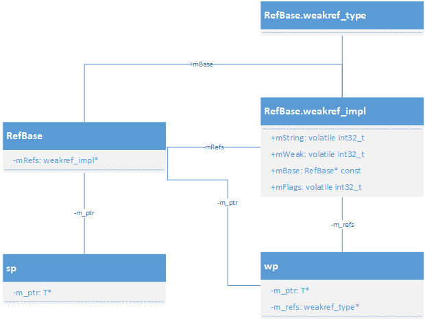
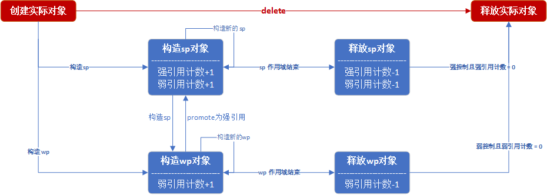
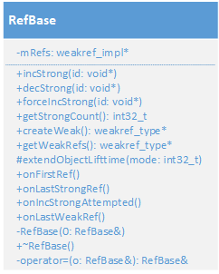
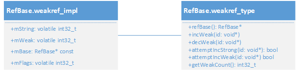
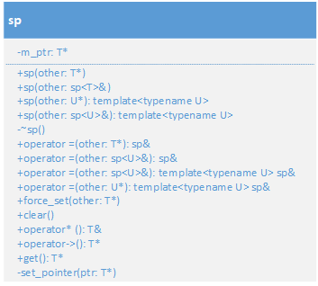

Android的核心库基本都是由C++代码编写的，这也证明了C++代码的潜力，面向对象的可扩展性很强，而且不失性能的流失，确实是大型项目的首选编程语言。

那么引入“智能”指针的目的是为了解决C++语言中经常性会发生的内存泄漏的问题，因为使用C/C++语言很多地方需要手动去分配内存，在C++语言中指针的使用使得很多时候会在不恰当的时候去释放内存，或者说忘记释放内存，导致内存泄漏，那么这里引入了智能指针可以比较有效的防止类似事情大量的发生，我这里只是保守的说防止大量发生，这是因为即使有了很好的工具，不正确的使用，也是无法防止错误的发生。

其实原理很简单，就是使用强指针(sp)、弱指针(wp)来代替普通的指针，这种指针基于引用计数，来智能的管理对象指针，并不需要开发者做过多的内存管理操作。

<!--more-->

```cpp
 class Student: public RefBase {
 public:
     Student(const char* name) {
         LOG(INFO) << "Create " << name << endl;
         ::strncpy(this->name, name, strlen(name));
     }

     ~Student() {
         LOG(INFO) << "Destroy " << name << endl;
     }
 private:
     char name[12];
     int age;
     int score;
 };

 void test_sp()
 {
     sp<Student> peter = new Student("Peter");
 }
```

运行结果如下：

```cpp
@_ root _ build git(main) ./service/example/example
I20211119 16:01:50.222349 24676 main.cpp:171] Create Peter
I20211119 16:01:50.222445 24676 main.cpp:176] Destroy Peter
```

可以看到虽然说没有使用delete来释放内存，但是当程序结束的时候自动调用了析构函数来释放内存，看着好像没啥问题，但是有一个互相引用的问题，如果两个强指针互相引用，那么就会双方都无法释放导致内存泄漏的问题。

```cpp
 class Student: public RefBase {
 public:
     Student(const char* name) {
         LOG(INFO) << "Create " << name << endl;
         ::strncpy(this->name, name, strlen(name));
     }

     ~Student() {
         LOG(INFO) << "Destroy " << name << endl;
     }
     void setStudent(sp<Student> st) {
         another = st;
     }
 private:
     char name[12];
     int age;
     int score;
     sp<Student> another;
 };

 void test_sp()
 {
     sp<Student> peter = new Student("Peter");
     sp<Student> peter2 = peter;
     peter->setStudent(peter2);

 }
```

运行结果：

```cpp
@_ root _ build git(main) ./service/example/example
I20211119 21:22:30.431556  7927 main.cpp:171] Create Peter
```

直到程序退出，也没有调用到Student的析构函数，也就是说分配的内存不会被释放掉，发生了内存泄漏。

那么解决这个问题，需要使用到弱指针来处理：

```cpp
 class Student: public RefBase {
 public:
     Student(const char* name) {
         LOG(INFO) << "Create " << name << endl;
         ::strncpy(this->name, name, strlen(name));
     }

     ~Student() {
         LOG(INFO) << "Destroy " << name << endl;
     }
     void setStudent(wp<Student> st) {
         another = st;
     }
 private:
     char name[12];
     int age;
     int score;
     wp<Student> another;
 };

 void test_sp()
 {
     sp<Student> peter = new Student("Peter");
     wp<Student> peter2 = peter;
     peter->setStudent(peter2);
 }
```

运行如下：

```cpp
@_ root _ build git(main) ./service/example/example
I20211119 21:36:41.249186 16312 main.cpp:171] Create Peter
I20211119 21:36:41.249261 16312 main.cpp:176] Destroy Peter
```

**简单的引用计数器不能解决循环引用的问题。**

A 引用 B ，B 引用 A，的时候，A不再使用，但是B引用着A，A不能释放。如果把引用分为强引用和弱引用，将引用关系方向化，父-子，子-父，则规定：父引用子为强引用，子引用父为弱引用，当子引用父的时候，父对象不再使用时，父对象生命周期的销毁不受子对象的约束。当释放了父对象，父对子的计数器也会被释放；当子不再使用的时候，子也就安全释放了，因为没有父对象对他进行强引用。总而言之就是：不能释放被强引用的对象，可以释放被弱引用的对象。

**被弱引用的对象不能被直接使用，需要升级为强引用**

如果一个对象A被B弱引用，因为A对象的销毁不受B控制，所以B不知道A是否销毁，就不能对A直接使用，需要将对A的弱引用升级为强引用之后才能使用。如果不能升级，说明A对象已经释放。

## Android智能指针的原理

有同学可能意识到，Android的智能指针使用里面，被管理的类需要继承一个`RefBase`的基类。

设计模板类sp、wp，用以引用实际对象，sp强引用和wp弱引用。sp、wp声明为栈对象，所以在作用于结束的时候会自动释放，自动调用析构函数。所以可以在sp、wp的构造函数中，引用计数递增，析构函数中递减。

`RefBase`中有一个内部类`weakref_impl`类，用来做真正的引用计数管理，创建实际对象时，同事会创建一个`mRefs`对象，不管是强引用还是弱引用，都由`mRefs`来管理，下面是Android智能指针之间的关系。



## Android智能指针的实现

根据前面的原理，先来看一个实例，然后剖析一下细节：

```cpp
 class Student: public RefBase {
 public:
     Student(const char* name) {
         LOG(INFO) << "Create " << name << endl;
         ::strncpy(this->name, name, strlen(name));
     }

     ~Student() {
         LOG(INFO) << "Destroy " << name << endl;
     }
 private:
     char name[12];
 };

 void test_sp()
 {
     Student* pStudent = new Student("Jay");
     {//++sp
         sp<Student> spStudent(pStudent);
         {//++wp
             wp<Student> wpStudent(pStudent);
         }//--wp
     }//--sp
 }
```

**RefBase的构造和mRefs**

在实例代码中，我们先定义了一个`Student`类，从`RefBase`派生出来，然后创建了一个实际的对象`pStudent`

在`Student`对象被创建的时候，会调用父类的构造函数，会创建`mRefs`

`weakref_impl`从`weakref_type`派生，`mRefs`是重点

```cpp
RefBase::RefBase()
    : mRefs(new weakref_impl(this))
{
}

#define INITIAL_STRONG_VALUE (1 << 28)

    weakref_impl(RefBase* base)
        : mStrong(INITIAL_STRONG_VALUE)
        , mWeak(0)
        , mBase(base) //指向实际的对象
        , mFlags(0)   //标识是强引用还是弱引用
    {
    }
```

`mFlags`的默认值是0可以通过修改该值来制定是强引用还是弱引用

```cpp
     //! Flags for extendObjectLifetime()
     enum {
         OBJECT_LIFETIME_STRONG  = 0x0000,
         OBJECT_LIFETIME_WEAK    = 0x0001,
         OBJECT_LIFETIME_MASK    = 0x0001
     };
```

初始值为`OBJECT_LIFETIME_STRONG`，强引用控制，设置为`OBJECT_LIFETIME_WEK`时，为弱引用控制。可以通过`extendObjectLiftetime`函数修改

```cpp
 void RefBase::extendObjectLifetime(int32_t mode)
 {
     android_atomic_or(mode, &mRefs->mFlags);
 }
```

**sp的构造**

当我们创建一个`sp`对象`spStudent`，这是一个栈对象，当在其作用域结束后悔被自动释放掉，并且调用对应的析构函数

```cpp
 template<typename T>
 sp<T>::sp(T* other)
         : m_ptr(other) {
     if (other)
         other->incStrong(this);
 }

 template<typename T>
 sp<T>::sp(const sp<T>& other)
         : m_ptr(other.m_ptr) {
     if (m_ptr)
         m_ptr->incStrong(this);
 }

 template<typename T> template<typename U>
 sp<T>::sp(U* other)
         : m_ptr(other) {
     if (other)
         ((T*) other)->incStrong(this);
 }

 template<typename T> template<typename U>
 sp<T>::sp(const sp<U>& other)
         : m_ptr(other.m_ptr) {
     if (m_ptr)
         m_ptr->incStrong(this);
 }
```

这里的`other`指向真正的`Student`对象，在`sp`的构造函数中将`other`复制给sp的`m_ptr`，`m_ptr`就指向了真正的`Student`对象。

因此，`other->incStrong(this)`，实际就是调用了`Student`的父类(`RefBase`)的`incStrong`函数：

```cpp
 void RefBase::incStrong(const void* id) const
 {
     weakref_impl* const refs = mRefs;
     refs->incWeak(id);

     refs->addStrongRef(id);
     const int32_t c = android_atomic_inc(&refs->mStrong); //weakref_impl的mStrong强引用计数+1
     ALOG_ASSERT(c > 0, "incStrong() called on %p after last strong ref", refs);
 #if PRINT_REFS
     ALOGD("incStrong of %p from %p: cnt=%d\n", this, id, c);
 #endif
     if (c != INITIAL_STRONG_VALUE)  {  //判断是否是第一次引用
         return;
     }
     //第一次引用，把refs->mStrong设置为1
     android_atomic_add(-INITIAL_STRONG_VALUE, &refs->mStrong);
     refs->mBase->onFirstRef();
 }
```

在这里最主要的是会把`mRefs`的强弱引用计数都+1

```cpp
 void RefBase::weakref_type::incWeak(const void* id)
 {
     weakref_impl* const impl = static_cast<weakref_impl*>(this);
     impl->addWeakRef(id);
     const int32_t c __unused = android_atomic_inc(&impl->mWeak);
     ALOG_ASSERT(c >= 0, "incWeak called on %p after last weak ref", this);
 }
```

**wp的构造**

接下来的一个作用域里面创建了一个`wp`的对象`wpStudent`，在其作用域结束的时候会自动释放，并且调用到`wp`的析构函数

```cpp
 template<typename T>
 wp<T>::wp(T* other)
     : m_ptr(other)
 {
     if (other) m_refs = other->createWeak(this);
 }

 template<typename T>
 wp<T>::wp(const wp<T>& other)
     : m_ptr(other.m_ptr), m_refs(other.m_refs)
 {
     if (m_ptr) m_refs->incWeak(this);
 }

 template<typename T>
 wp<T>::wp(const sp<T>& other)
     : m_ptr(other.m_ptr)
 {
     if (m_ptr) {
         m_refs = m_ptr->createWeak(this);
     }
 }

 template<typename T> template<typename U>
 wp<T>::wp(U* other)
     : m_ptr(other)
 {
     if (other) m_refs = other->createWeak(this);
 }

 template<typename T> template<typename U>
 wp<T>::wp(const wp<U>& other)
     : m_ptr(other.m_ptr)
 {
     if (m_ptr) {
         m_refs = other.m_refs;
         m_refs->incWeak(this);
     }
 }

 template<typename T> template<typename U>
 wp<T>::wp(const sp<U>& other)
     : m_ptr(other.m_ptr)
 {
     if (m_ptr) {
         m_refs = m_ptr->createWeak(this);
     }
 }
```

同理这里的`other`指向真正的`Student`对象，在`wp`的构造函数中，将`other`赋值给了`wp`的`m_ptr`，`m_ptr`就指向了真正的`Student`对象。

所以，`other->creatWeak(this)`，实际上就是调用了父类`RefBase`的`createWeak`函数：

```cpp
 RefBase::weakref_type* RefBase::createWeak(const void* id) const
 {
     mRefs->incWeak(id); // 弱引用+1
     return mRefs;
 }
```

这里调用`incWeak`，弱引用计数+1，至此我们`Student`对象的强引用计数为1，弱引用计数为2.

返回值为`mRefs`，也就是`m_refs`和`mRefs`指向同一个`weakref_impl`对象，而`mRefs`和`mBase`指向真正的`Student`对象。因此此处的`spStudent`和`wpStudent`都是管理同一个真正的对象。

**wp的析构**

当`wpStudent`的作用域结束后，会调用到`sp`的析构函数，代码如下：

```cpp
 template<typename T>
 wp<T>::~wp()
 {
     if (m_ptr) m_refs->decWeak(this);
 }
```

可以看到在`wp`的析构中就是调用了`decWeak`函数，`m_refs`和`mRef`指向同一个`weakref_impl`对象。`decWeak`函数代码如下：

```cpp
 void RefBase::weakref_type::decWeak(const void* id)
 {
     weakref_impl* const impl = static_cast<weakref_impl*>(this);
     impl->removeWeakRef(id);
     const int32_t c = linking_atomic_dec(&impl->mWeak);
     ALOG_ASSERT(c >= 1, "decWeak called on %p too many times", this);
     if (c != 1) return; //是否是最后一次引用计数

     if ((impl->mFlags&OBJECT_LIFETIME_WEAK) == OBJECT_LIFETIME_STRONG) {
         // This is the regular lifetime case. The object is destroyed
         // when the last strong reference goes away. Since weakref_impl
         // outlive the object, it is not destroyed in the dtor, and
         // we'll have to do it here.
         if (impl->mStrong == INITIAL_STRONG_VALUE) {
             // Special case: we never had a strong reference, so we need to
             // destroy the object now.
             delete impl->mBase; //释放实际对象
         } else {
             // ALOGV("Freeing refs %p of old RefBase %p\n", this, impl->mBase);
             delete impl; //释放mRefs
         }
     } else {
         // less common case: lifetime is OBJECT_LIFETIME_{WEAK|FOREVER}
         impl->mBase->onLastWeakRef(id);
         if ((impl->mFlags&OBJECT_LIFETIME_MASK) == OBJECT_LIFETIME_WEAK) {
             // this is the OBJECT_LIFETIME_WEAK case. The last weak-reference
             // is gone, we can destroy the object.
             delete impl->mBase; //弱引用控制，释放实际对象
         }
     }
 }
```

稍微总结一下`wp`的析构过程：

- 弱引用技术-1
- 最后一次弱引用时，强引用控制，释放mRefs，若没有强引用，释放实际对象
- 最后一次弱引用时，弱引用控制，释放实际对象

回到例子当中，此时，强引用计数为1，弱引用计数为1，并没有任何释放。

**sp的析构**

在例子当中，当`wp`析构完成之后，`sp`的作用域也结束了，就会调用到`sp`的析构函数：

```cpp
 template<typename T>
 sp<T>::~sp() {
     if (m_ptr)
         m_ptr->decStrong(this);
 }
```

在析构函数中调用了`m_ptr`的`decStrong`函数，`m_ptr`是指向了实际对象，那么也就是说调用到了基类`RefBase`的`decStrong`函数:

```cpp
 void RefBase::decStrong(const void* id) const
 {
     weakref_impl* const refs = mRefs;
     refs->removeStrongRef(id);
     const int32_t c = android_atomic_dec(&refs->mStrong);
 #if PRINT_REFS
     ALOGD("decStrong of %p from %p: cnt=%d\n", this, id, c);
 #endif
     ALOG_ASSERT(c >= 1, "decStrong() called on %p too many times", refs);
     if (c == 1) {
         refs->mBase->onLastStrongRef(id);
         if ((refs->mFlags&OBJECT_LIFETIME_MASK) == OBJECT_LIFETIME_STRONG) {
             delete this; //最后一次强引用计数，释放实际对象
         }
     }
     refs->decWeak(id);
 }
```

`sp`的析构完成，主要完成下面几个工作：

- 强引用计数-1，弱引用计数-1
- 最后一次强引用计数时，如果是强引用控制，就释放实际对象，释放`mRefs`，并且调用`onLastStrongRef`函数

再回到例子当中，当`spStudent`的作用域结束的时候，强引用计数为0，弱引用计数为0，调用到`RefBase`的析构函数来释放实际对象。

**RefBase的析构**

前面分析到了当强引用计数都为0的时候，去释放实际对象，先来看一下`RefBase`的析构是如何处理的

```cpp
 RefBase::~RefBase()
 {
     if (mRefs->mStrong == INITIAL_STRONG_VALUE) {
         // we never acquired a strong (and/or weak) reference on this object.
         delete mRefs;
     } else {
         // life-time of this object is extended to WEAK or FOREVER, in
         // which case weakref_impl doesn't out-live the object and we
         // can free it now.
         if ((mRefs->mFlags & OBJECT_LIFETIME_MASK) != OBJECT_LIFETIME_STRONG) {
             // It's possible that the weak count is not 0 if the object
             // re-acquired a weak reference in its destructor
             if (mRefs->mWeak == 0) {
                 delete mRefs;
             }
         }
     }
     // for debugging purposes, clear this.
     const_cast<weakref_impl*&>(mRefs) = NULL;
 }
```

可以看到，在`RefBase`的析构函数中主要任务就是去释放`mRefs`指向的`weakref_imp`实际对象。

至此，实例代码中的流程已经分析完了，再来看一下我们实际对象的状态变化图：



基于Android智能指针对象的状态变化

## Android智能指针的使用

前面通过示例代码，追溯了Android智能指针的生命周期和原理，下面详细看一下智能指针的特写特性。

**RefBase的特性**

先来看一下`RefBase`的类图




- 所有类必须从`RefBase`派生，只有一个无参构造函数，`RefBase`析构函数需申明为virtual
- 在构造函数中创建`mRefs`对象，为`weakref_impl`类型
- 可以在派生类中通过函数`extendObjectLifetime`指定是强引用控制，还是弱引用控制，默认为强引用
- 在析构函数中，判断是否释放`mRefs`
- 私有的构造函数和赋值运算重载，不允许子类使用
- 获取实际对象的强引用计数`getStrongCount`
- 子类可派生`virtual`成员函数，获取自身的引用情况

mRefs指向一个weakrf_impl对象，是RefBase的引用计数管家，




- 可以通过`getWeakRefs()->gtStrongCount()`获取实际对象的弱引用计数




- 提供多种形式的构造方法
- 定义多种形式的赋值运算操作
- 重载操作运算符*，可以获取实际对象
- 重载操作`->`，可以获取指向实际对象的指针
- 可通过`get`函数，获取实际对象的指针
- `force_set`函数可以指定sp引用的实际对象，该函数设计有缺陷

**wp模板类特性**


- 提供多种构造方式
- 定义多种赋值运算操作
- 可以通过`unsafe_get`函数，获取实际对象的指针，但是可能获取到的是空的或者是野指针
- 可以通过`promote`函数将弱引用变成强引用，这个是一个比较重要的函数，下面是一个例子

```cpp
void testPromote() {
	Student* pStudent = new Student("Jay");
	wp<Student> wpStudent(pStudent);
	sp<Student> spStudent = wpStudent.promote();
}
```

具体实现如下：

```cpp
 template<typename T>
 sp<T> wp<T>::promote() const
 {
     sp<T> result;
     if (m_ptr && m_refs->attemptIncStrong(&result)) {
         result.set_pointer(m_ptr);
     }
     return result;
 }
```

```cpp
 bool RefBase::weakref_type::attemptIncStrong(const void* id)
 {
     incWeak(id); //弱引用计数+1，在例子中此时弱引用计数为2

     weakref_impl* const impl = static_cast<weakref_impl*>(this);
     int32_t curCount = impl->mStrong;

     ALOG_ASSERT(curCount >= 0,
             "attemptIncStrong called on %p after underflow", this);

     while (curCount > 0 && curCount != INITIAL_STRONG_VALUE) {
         // we're in the easy/common case of promoting a weak-reference
         // from an existing strong reference.
         if (android_atomic_cmpxchg(curCount, curCount+1, &impl->mStrong) == 0) {
             break;
         }
         // the strong count has changed on us, we need to re-assert our
         // situation.
         curCount = impl->mStrong;
     }

     if (curCount <= 0 || curCount == INITIAL_STRONG_VALUE) {
         // we're now in the harder case of either:
         // - there never was a strong reference on us
         // - or, all strong references have been released
         if ((impl->mFlags&OBJECT_LIFETIME_WEAK) == OBJECT_LIFETIME_STRONG) {
             // this object has a "normal" life-time, i.e.: it gets destroyed
             // when the last strong reference goes away
             if (curCount <= 0) {
                 // the last strong-reference got released, the object cannot
                 // be revived.
                 decWeak(id);
                 return false;
             }

             // here, curCount == INITIAL_STRONG_VALUE, which means
             // there never was a strong-reference, so we can try to
             // promote this object; we need to do that atomically.
             while (curCount > 0) {
                 if (android_atomic_cmpxchg(curCount, curCount + 1,
                         &impl->mStrong) == 0) { //强引用控制，强引用计数+1
                     break;
                 }
                 // the strong count has changed on us, we need to re-assert our
                 // situation (e.g.: another thread has inc/decStrong'ed us)
                 curCount = impl->mStrong;
             }

             if (curCount <= 0) {
                 // promote() failed, some other thread destroyed us in the
                 // meantime (i.e.: strong count reached zero).
                 decWeak(id);
                 return false;
             }
         } else {
             // this object has an "extended" life-time, i.e.: it can be
             // revived from a weak-reference only.
             // Ask the object's implementation if it agrees to be revived
             if (!impl->mBase->onIncStrongAttempted(FIRST_INC_STRONG, id)) {
                 // it didn't so give-up.
                 decWeak(id);
                 return false;
             }
             // grab a strong-reference, which is always safe due to the
             // extended life-time.
             curCount = android_atomic_inc(&impl->mStrong);  //弱引用计数+1
         }

         // If the strong reference count has already been incremented by
         // someone else, the implementor of onIncStrongAttempted() is holding
         // an unneeded reference.  So call onLastStrongRef() here to remove it.
         // (No, this is not pretty.)  Note that we MUST NOT do this if we
         // are in fact acquiring the first reference.
         if (curCount > 0 && curCount < INITIAL_STRONG_VALUE) {
             impl->mBase->onLastStrongRef(id);
         }
     }

     impl->addStrongRef(id);

 #if PRINT_REFS
     ALOGD("attemptIncStrong of %p from %p: cnt=%d\n", this, id, curCount);
 #endif

     // now we need to fix-up the count if it was INITIAL_STRONG_VALUE
     // this must be done safely, i.e.: handle the case where several threads
     // were here in attemptIncStrong().
     curCount = impl->mStrong;
     while (curCount >= INITIAL_STRONG_VALUE) {
         ALOG_ASSERT(curCount > INITIAL_STRONG_VALUE,
                 "attemptIncStrong in %p underflowed to INITIAL_STRONG_VALUE",
                 this);
         if (android_atomic_cmpxchg(curCount, curCount-INITIAL_STRONG_VALUE,
                 &impl->mStrong) == 0) {
             break;
         }
         // the strong-count changed on us, we need to re-assert the situation,
         // for e.g.: it's possible the fix-up happened in another thread.
         curCount = impl->mStrong;
     }

     return true; //由弱变强
 }
```

在`promote`函数调用成功之后，强引用计数+1，弱引用计数+1.在例子中，强引用计数为1，弱引用计数为2

那么什么情况下会让一个弱引用变成一个强引用呢？

因为通过弱引用`wp`，不能获取实际的对象，wp并没有提供类似sp的操作符重载`*`和`->`，由弱变强后，可以通过sp获取到实际的对象。

## 总结

Android的智能指针巧妙的运用了C++的基本原理实现，其实C++中也提供了类似的概念，这里做个简单的对比

主要是如下几种：`~~std::auto_ptr~~`, `std::unique_ptr`, `std::shared_ptr`和`std::weak_ptr`，可以看到其中auto_ptr已经被弃用了

`unique_ptr`是一种强引用指针，但是`unique_ptr`就如同它的名字一样，是独占目标对象，试图直接转移到另外一个强引用上会报错，需要使用`std::move`函数来转移使用权：

```cpp
std::unique_ptr<Monster> monster1(new Monster());//monster1 指向 一个怪物
std::unique_ptr<Monster> monster2 = monster1;//Error!编译期出错，不允许复制指针指向同一个资源。
std::unique_ptr<Monster> monster3 = std::move(monster1);//转移所有权给monster3.
monster1->doSomething();//Oops!monster1指向nullptr，运行期崩溃
```

`shared_ptr`是一种强引用指针，可以进行共享和转移，类似`android::sp`，读个`shared_ptr`指向同一处资源，当所有`shared_ptr`都全部释放时，该处的资源才会被真正释放掉。

每一个shared_ptr都占指针的两倍空间，一个装着原始指针，一个装着计数区域的指针，用法和`android::sp`一样

```cpp
void runGame(){
　　std::shared_ptr<Monster> monster1(new Monster());　　　//计数加到1
　　do{
			std::shared_ptr<Monster> monster2 = monster1;　　　　//计数加到2
　　}while(0);　　　　　　　　　　
　　//该栈退出后，计数减为1，monster1指向的堆对象仍存在

　　std::shared_ptr<Monster> monster3 = monster1;　　　　　　//计数加到2
}
//该栈退出后，shared_ptr都释放了，计数减为0，它们指向的堆对象也能跟着释放.
```

同样的问题，两个`shared_ptr`互相引用的话，会导致无法释放。

`weak_ptr`那么这个就和`android:wp`是类似的，可以有效的解决上面说得互相引用问题。

所以C++11和Android中智能指针的区别就是Android的目标对象必须继承`RefBase`类，而C++11不需要，但是C++11中使用`shared_ptr`会占用两倍的真正空间。