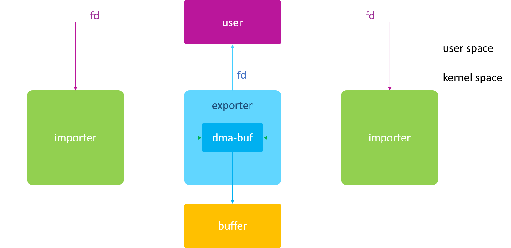

#### 前言

由于最近在开发新平台和新的Android 11的移植工作，需要把以前的一些驱动和方案移植到最新的`Android OS`上，有遇到一些`Android OS`间的差异，导致了有一些代码的调整，我这里就遇到了`ION`接口的改动导致需要做一些代码的调整，具体`ION`的接口差异可以查看下面的文章：

https://zhangjie201412.github.io/2021/02/16/Android-ION-3-DMA-BUF/

以前对`dma-buf`有一些认知，既然这还是比较新的一个知识点，那么我们就来系统的学习一下，以便于后面遇到了可以很方便的读懂代码。

<!--more-->

`dma-buf`在Linux驱动中出现最多的就是在多媒体模块方面了，如果你接触过Android的Video、Camera、Display还是GPU，他们使用的buffer都是通过ION分配的，而现在Android的kernel中的ION的实现都是基于dma-buf。

#### 历史

dma-buf 最初的原型为 `shrbuf`，由 Marek Szyprowski （Samsung）于2011年8月2日首次提出，他实现了 “Buffer Sharing” 的概念验证（Proof-of-Concept），并在三星平台的 `V4L2` 驱动中实现了 `camera` 与 `display` 的 buffer 共享问题。该 patch 发表后，在内核社区引起了巨大反响，因为当时关于 buffer 共享问题很早就开始讨论了，但是由于内核没有现成的框架支持，导致各个厂商实现的驱动五花八门，此时急需要一个统一的框架来解决 buffer 共享问题。

- LWN: [Buffer sharing proof-of-concept](https://lwn.net/Articles/455098/)
- LWN: [Sharing buffers between devices](https://lwn.net/Articles/454389/)

于是 Sumit Semwal (Linaro) 基于 Marek Szyprowski 的 patch 重构了一套新的框架，也就是我们今天看到的 `dma-buf `核心代码，它经历了社区开发人员给出的重重考验，并最终于 2012 年 2 月 merge 到了 Linux-3.3 主线版本中，这也是 `dma-buf` 的第一个正式版本。此后 `dma-buf` 被广泛应用于内核多媒体驱动开发中，尤其在 V4L2、DRM 子系统中得到了充分应用。

- LWN: [DMA buffer sharing in 3.3](https://lwn.net/Articles/474819/)
- Patch: [dma-buf: Documentation for buffer sharing framework](https://cgit.freedesktop.org/~airlied/linux/commit/?h=drm-prime-dmabuf&id=22e1c055c1c1c300761d784faab26e6db2f068b9)
- Patch: [dma-buf: Introduce dma buffer sharing mechanism](https://cgit.freedesktop.org/~airlied/linux/commit/?h=drm-prime-dmabuf&id=dc4e05acd66a13a1a30de07f21a0420f2949caa8)
- 第一个使用 dma-buf 的 DRM 分支: [drm-prime-dmabuf](https://cgit.freedesktop.org/~airlied/linux/log/?h=drm-prime-dmabuf)

#### 概念

dna-buf的出现就是为了解决各个驱动之间buffer共享的问题，因此它的本质上是buffer与file的结合，即dma-buf即是块物理buffer，又是个Linux file。buffer是内容，file是媒介，只有通过file这个媒介才能实现同一buffer在不同驱动之间的流转。
下面是一个典型的dma-buf应用框图：

通常我们会把分配buffer的模块称为`exporter`，将使用该buffer的模块称为`importer`或者`user`。这里importer特指内核空间的使用者，user特指用户空间的使用者。
有的人习惯将 exporter 说成是生产者，importer 说成是消费者，我个人认为这样的说法并不严谨。举例来说，Android 系统中，graphic buffer 都是由 ION 来分配的，GPU 负责填充该 buffer，DPU 负责显示该 buffer。那么在这里，ION 则是 exporter，GPU 和 DPU 则都是 importer。但是从生产者/消费者模型来讲，GPU 则是生产者，DPU 是消费者，因此不能片面的认为 exporter 就是生产者。