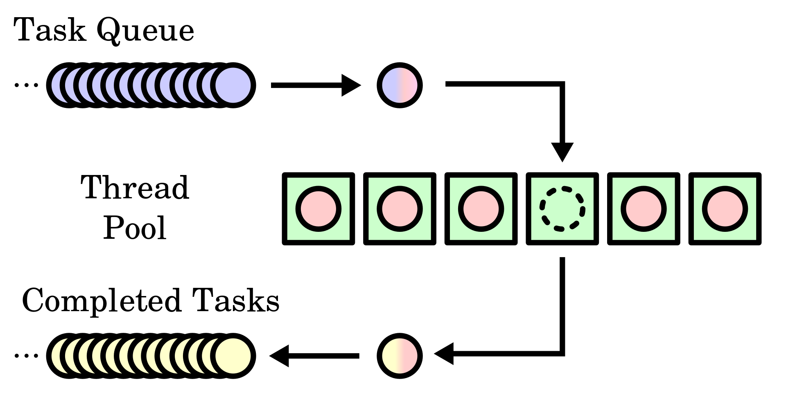

### 前言

基本上每一种编程语言都会支持多线程，这里我们只讲C/C++，C/C++是真正的native language。

现代操作系统都是支持多线程的，不管是单核还是多核，多线程的编程，也可以非常有效的利用CPU的执行来解决很多复杂的问题，并且在多核的情况下更好的让多核CPU核心共同协调工作。

- **Posix Threads(pthread)**: 对不同platform的支持很好，你可以非常稳定可靠的使用，如果想让你的代码可移植性非常强的话，使用`pthread`是毫无疑问的
- **std::thread**: 是从C++11中引入，在不同的平台上表现各异，比如在一些Android和Win64平台下不支持，或者有性能瓶颈，当然了如果你的代码只是考虑到Linux/gcc平台编译器的话，是个不错的选择，特别是对C++11的类非常友好
- **boost::thread**: 对`std::thread`是个非常好的替代品，而且API也非常相似，但是`boost::thread`是一个第三方库，一般都需要移植到你正在使用的平台

<!--more-->

但是总的来说还是要以发展的眼光看待`std::thread`，毕竟C++的所谓现代化API也一直在更新发展，不知道后面是会主打兼容性还是高性能，还有可能会两者兼顾。

这里，还是采用基于`Posix Threads`来写一个线程管理的工具类，通常也可以认为是一个线程池。

### 设计思想

设计一个ThreadManager类，来给别的代码使用，提供如下API

```cpp
static Result ThreadManager::create(ThreadManager** ppInstance, const char* pName); 
void destroy();
Result registerJobFamily(JobFunc jobFuncAddr, const char* pJobFuncName, JobHandle* phJob);
Result unregisterJobFamily(JobFunc jobFuncAddr, const char* pJobFuncName, JobHandle* phJob);
Result postJob(JobHandle hJob, void* pData, uint64_t requestId);
Result removeJob(JobHandle hJob, void* pData);
Result getAllPostedJobs(JobHandle hJob, std::vector<void*>& rPostedJobs);
Result flushJob(JobHandle hJob, bool forceFlush);
bool isJobAvailable(JobHandle hJob);
```

看了这些API大致了解到这个类是如何使用的了，也没有过多复杂的接口，可以看到这里使用JobHandle来作为一个任务的唯一标识。

```cpp
typedef uint64 JobHandle;
```

后面会看到一些内部使用的数据结构，很容易明白是如何设计的。

作为一个线程池的工具类，主要的目的是在需要运行自己的工作线程之前，把线程的资源都分配好，可以更快的让线程运行起来，并且对该线程池的资源的管理和使用。



每一个`JobHandle`都可以插入多个任务组成一个`PendingQueue`，依次执行，也可以设计优先级去处理，这里的代码没有设计优先级，实行先进先出(FIFO)的规则。

设计一个线程管理或者说线程池，其实难度在于如何处理多线程带来的资源保护和线程状态切换，以及如何保证性能不受影响。

### 码代码

首先还是来看数据结构，数据结构基本决定了代码都走向和设计风格，以及写代码的人到底在想些什么，考虑到了哪些部分等。

**注册线程Job的信息**

```cpp
struct RegisteredJob {
    JobFunc         funcAddr;
    char            name[MaxNameLength];
    bool            isUsed;
    uint64_t        hRegister;
    uint32_t        slot;
    uint32_t        uniqueCounter;
    OSThreadHandle  hRegisteredThread;
    JobFlushStatus  flushStatus;
};

typedef void* (*JobFunc)(void* pArg);
typedef pthread_t OSThreadHandle;

static const JobFlushStatus Noflush         = 0;
static const JobFlushStatus FlushRequested  = 1;
static const JobFlushStatus Flushed         = 2;
```

- ***funcAddr***: 是注册的Job的工作函数
- ***name***: 是注册的Job的名称
- ***isUsed***: 该Job是否已经被使用
- ***hRegister***: 注册的Job的handle值，通过slot和count组合而成
- ***slot***: 注册的Job的slot
- ***uniqueCounter***: 注册的Job的id号
- ***hRegisteredThread***: 注册的线程的句柄
- ***flushStatus***: flush的状态值

**Job的Runtime信息，每一个等待或者正在执行的Job都具有一个RutimeJob结构体对象**

```cpp
struct RuntimeJob {
    uint64_t    hJob;
    void*       pData;
    uint64_t    requestId;
    JobStatus   status;
};
enum class JobStatus {
    Submitted,
    Ready,
    OnHold,
    Stopped,
    Invalid,
};
```

- ***hJob***: Job的handle唯一标识
- ***pData***: 工作函数携带的私有数据
- ***requestId***: 请求id号，可以通过requestId号来重排PendingQueue中任务的优先级
- ***status***: 工作状态

**线程的控制参数，保护线程信息和RuntimeJob中的一些状态和线程的控制**

```cpp
struct ThreadControl {
    NativeMutex*              pThreadLock;
    NativeMutex*              pFlushJobSubmitLock;
    NativeMutex*              pQueueLock;
    NativeMutex*              pFlushLock;
    NativeCondition*          pReadOK;
    NativeCondition*          pFlushOK;
    CoreStatus                status;
    volatile bool             jobPending;
    volatile uint32_t         blockingStatus;
    bool                      isAvailable;
};
static const CoreStatus Error           = 0;
static const CoreStatus Initialized     = 1;
static const CoreStatus Stopped         = 2;
```

- ***pThreadLock***: 确保线程依次运行，不被抢占
- ***pFlushJobSubmitLock***: 保护flashStatus
- ***pQueueLock***: 保护PendingQueue数据
- ***pFlushLock***: 保护flash状态
- ***pReadOK***: 等待线程被触发信号
- ***pFlushOK***: 等待线程被释放信号
- ***status***: 线程的状态值
- ***jobPending***: 任务队列是否空闲
- ***blockingStatus***: 确保线程释放完成
- ***isAvailable***: 线程是否空闲

**线程配置信息结构体**

```cpp
struct ThreadData {
    std::deque<RuntimeJob*> pq;
};

struct ThreadConfig {
    uint32_t            threadId;
    OSThreadHandle      hWorkThread;
    JobFunc             workThreadFunc;
    void*               pContext;
    ThreadData          data;
    ThreadControl       ctrl;
    bool                isUsed;
};
```

- ***threadId*:** 线程ID号
- ***hWorkThread:*** 线程句柄
- ***workThreadFunc***: 线程回调函数
- ***pContext***: 上下文句柄，通常为ThreadManager指针
- ***data***: 挂载在该线程上的等待队列
- ***ctrl***: 线程控制类
- ***isUsed***: 该线程是否被使用

**类的成员变量**

```cpp
char            m_name[MaxNameLength];                     //线程池名称
uint32_t        m_totalNumOfRegisteredJob;                 //当前注册的数目
RegisteredJob   m_registeredJobs[MaxRegisteredJobs];       //注册的Job主体
ThreadConfig    m_threadWorker[MaxNumThread];              //线程配置信息主体
NativeMutex*    m_pRegisteredJobLock;                      //保护注册信息的锁
```

**创建/销毁ThreadManager对象**

```cpp
Result ThreadManager::create(ThreadManager** ppInstance, const char* pName)
{
    Result          result         = -EFailed;
    ThreadManager*  pLocalInstance = NULL;

    pLocalInstance = new ThreadManager();
    if(NULL != pLocalInstance) {
        result = pLocalInstance->initialize(pName);
        if(Ok != result) {
            delete pLocalInstance;
            pLocalInstance = NULL;
            LOG(ERROR) << "Failed to create threadmanager" << endl;
        }
    }
    if(Ok == result) {
        *ppInstance = pLocalInstance;
    }
    return result;
}

Result ThreadManager::initialize(const char* pName)
{
    Result result = Ok;
    if(NULL == pName) {
        pName = "ThreadManager";
    }
    ::strncpy(m_name, pName, sizeof(m_name));
    m_pRegisteredJobLock = NativeMutex::create();
    if(NULL == m_pRegisteredJobLock) {
        LOG(ERROR) << "Failed to initialize " << pName << endl;
        result = -EFailed;
    } else {
        ::memset(&m_registeredJobs, 0x00, sizeof(m_registeredJobs));
        for(uint32_t i = 0; i < MaxNumThread; i++) {
            m_threadWorker[i].threadId = 0;
            m_threadWorker[i].workThreadFunc = NULL;
            m_threadWorker[i].pContext = NULL;
            ::memset(&m_threadWorker[i].ctrl, 0x00, sizeof(ThreadControl));
            m_threadWorker[i].isUsed = false;
        }
        //LOG(INFO) << "Initialzed " << pName << endl;
    }

    return result;
}

ThreadManager::~ThreadManager()
{
    Result result = Ok;

    if(m_totalNumOfRegisteredJob > 0) {
        RegisteredJob* pRegisteredJob = NULL;
        for(uint32_t i = 0; i < MaxRegisteredJobs; i++) {
            pRegisteredJob = &m_registeredJobs[i];
						//反注册已经注册的任务
            if(0 != pRegisteredJob->hRegister) {
                result = unregisterJobFamily(NULL, pRegisteredJob->name,
                    pRegisteredJob->hRegister);
                if(Ok != result) {
                    LOG(ERROR) << "Failed to process unregisterJobFamily slot " <<
                        pRegisteredJob->slot << endl;
                }
            }
        }
    }
    m_pRegisteredJobLock->destroy();
    m_pRegisteredJobLock = NULL;
}
```

**注册线程过程**

```cpp
Result ThreadManager::registerJobFamily(JobFunc jobFuncAddr, const char* pJobFuncName,
    JobHandle* phJob)
{
    Result          result          = Ok;
    uint32_t        slot            = 0;
    uint32_t        count           = 0;
    RegisteredJob*  pRegisteredJob  = NULL;

    //判断该job handle是否已经注册过了
    bool jobAlreadyRegistered = isJobAlreadyRegistered(phJob);
    //获取空闲slot和已经注册的数目
    bool freeSlotsAvailable   = isFreeSlotAvailable(&slot, &count);

    if((true == jobAlreadyRegistered) ||
       (false == freeSlotsAvailable))
    {
        LOG(ERROR) << "Failed to registerJobFamily, jobAlreadyRegistered: " <<
            jobAlreadyRegistered << ", freeSlotsAvailable: " <<
            freeSlotsAvailable << endl;
        result = -EFailed;
    }
    if(Ok == result) {
        //空闲slot获取注册信息对象指针
        pRegisteredJob                  = &m_registeredJobs[slot];
        ::memset(pRegisteredJob, 0x00, sizeof(RegisteredJob));
        pRegisteredJob->funcAddr        = jobFuncAddr;
        pRegisteredJob->slot            = slot;
        pRegisteredJob->uniqueCounter   = count;
        pRegisteredJob->isUsed          = true;

        ::strncpy(pRegisteredJob->name, pJobFuncName, MaxNameLength);
        //通过slot和uniqueCounter来计算job handle值
        *phJob                          = packJobHandleFromRegisteredJob(pRegisteredJob);
        pRegisteredJob->hRegister       = *phJob;
        //启动线程
        result = startThreads(slot, phJob);
        if(Ok == result) {
            if(0 != pRegisteredJob->hRegisteredThread) {
                setFlushStatus(*phJob, Noflush);
            } else {
                LOG(ERROR) << "Failed to get thread handle" << endl;
                result = -EFailed;
            }
        }
    }
    return result;
}

//通过slot和uniqueCounter来计算job handle值
JobHandle packJobHandleFromRegisteredJob(RegisteredJob* pRegisteredJob)
{
    JobHandle handle = InvalidJobHandle;
    handle = pRegisteredJob->uniqueCounter;
    handle = handle << 32;
    handle |= pRegisteredJob->slot;
    return handle;
}

Result ThreadManager::startThreads(uint32_t slot, JobHandle* phJob)
{
		//通过handle获取RegisteredJob信息
    RegisteredJob* pRegisteredJob = getJobByHandle(*phJob);
    Result         result         = Ok;
    ThreadConfig*  pCfg           = NULL;
    //获取到空的ThreadConfig指针
    pCfg = &m_threadWorker[slot];

    if((NULL == pRegisteredJob) || (pCfg->isUsed == true)) {
        //LOG(INFO) << "Slot " << slot <<
        //    " is already occupied. totalNumOfRegisteredJob " <<
        //    m_totalNumOfRegisteredJob << endl;
        result = -EFailed;
    } else {
				//填充ThreadConfig指针，初始化对应的锁和信号量
        pCfg->threadId                  = pRegisteredJob->uniqueCounter;
        pCfg->workThreadFunc            = workerThreadBody;
        pCfg->ctrl.pReadOK              = NativeCondition::create();
        pCfg->ctrl.pThreadLock          = NativeMutex::create();
        pCfg->ctrl.pFlushJobSubmitLock  = NativeMutex::create();
        pCfg->ctrl.pQueueLock           = NativeMutex::create();
        pCfg->ctrl.pFlushOK             = NativeCondition::create();
        pCfg->ctrl.pFlushLock           = NativeMutex::create();
        pCfg->ctrl.isAvailable          = true;
				//获取上下文指针
        pCfg->pContext                  = reinterpret_cast<void*>(this);
        //标记已经被使用
        pCfg->isUsed                    = true;

        if((NULL == pCfg->ctrl.pReadOK) ||
           (NULL == pCfg->ctrl.pThreadLock) ||
           (NULL == pCfg->ctrl.pFlushJobSubmitLock) ||
           (NULL == pCfg->ctrl.pQueueLock))
        {
            LOG(ERROR) << "Couldn't read lock resource. slot " << slot <<
                " m_totalNumOfRegisteredJob " << m_totalNumOfRegisteredJob << endl;
            pCfg->isUsed = false;
            result = -EFailed;
        }
        if(Ok == result) {
            //创建病启动线程，传入的参数为ThreadConfig对象指针
            result = OsUtils::threadCreate(pCfg->workThreadFunc,
                pCfg, &pCfg->hWorkThread);
            if(Ok == result) {
                pRegisteredJob->hRegisteredThread = pCfg->hWorkThread;
                pCfg->ctrl.pThreadLock->lock();
                //标记当前线程状态为Initialized
                setStatus(&pCfg->ctrl, Initialized);
                pCfg->ctrl.pThreadLock->unlock();
            } else {
                LOG(ERROR) << "Couldn't create worker thread, logical threadId " <<
                    pCfg->threadId << endl;
                pCfg->isUsed = false;
                result = -EFailed;
            }
        }
        //LOG(INFO) << "ThreadId " << pCfg->threadId << " workThreadFunc" <<
        //    pCfg->workThreadFunc << " hWorkThread" << pCfg->hWorkThread <<
        //    " ReadOk " << pCfg->ctrl.pReadOK << endl << "threadLock " <<
        //    pCfg->ctrl.pThreadLock << " flushjobsumbit lock " <<
        //    pCfg->ctrl.pFlushJobSubmitLock << " queuelock " <<
        //    pCfg->ctrl.pQueueLock << " context " << pCfg->pContext <<
        //    " isUsed " << pCfg->isUsed << ", slot " << slot <<
        //    " NumOfRegisgteredJob " << m_totalNumOfRegisteredJob << endl;
    }
    return result;
}

void* ThreadManager::workerThreadBody(void* pArg)
{
    ThreadConfig* pConfig = NULL;
    pConfig = reinterpret_cast<ThreadConfig*>(pArg);
    if(NULL != pConfig) {
				//通过ThreadConfig中的上下文指针获取到ThreadManager对象，然后调用doWork函数，并传入线程ThreadConfig对象
        ThreadManager* pThreadManager = reinterpret_cast<ThreadManager*>(pConfig->pContext);
        pThreadManager->doWork(pArg);
    }

    return NULL;
}

void* ThreadManager::doWork(void* pArg)
{
    Result          result  = Ok;
    ThreadConfig*   pConfig = NULL;
    ThreadControl*  pCtrl   = NULL;

    //指针转为ThreadConfig对象
    pConfig = reinterpret_cast<ThreadConfig*>(pArg);
    //获取到ThreadControl对象
    pCtrl = &pConfig->ctrl;

    if(NULL == pCtrl) {
        LOG(ERROR) << "Failed to start" << endl;
    } else {
        pCtrl->pThreadLock->lock();
        //判断线程是否需要退出
        while(Stopped != getStatus(pCtrl)) {
            while((Stopped != getStatus(pCtrl)) && (false == pCtrl->jobPending)) {
                //确保线程不退出，以及没有工作在等待队列在
								//等待pReadOK信号
                pCtrl->pReadOK->wait(pCtrl->pThreadLock->getNativeHandle());
            }
            //被pReadOK信号唤醒，标记当前没有任务队列
            if(Stopped != getStatus(pCtrl)) {
                pCtrl->jobPending = false;
                pCtrl->pThreadLock->unlock();
            }
            //处理工作队列
            result = processJobQueue(pConfig);
            //确保线程安全退出
            if(true == getFlushBlockStatus(pCtrl)) {
                pCtrl->pFlushLock->lock();
                //标记当前不阻塞退出
                setFlushBlockStatus(pCtrl, false);
                //发送pFlushOK信号，触发线程退出
                pCtrl->pFlushOK->signal();
                pCtrl->pFlushLock->unlock();
            }
            pCtrl->pThreadLock->lock();
            if(Ok != result) {
                LOG(ERROR) << "ProcessJobQueue failed with result" << endl;
            }
        }
        pCtrl->pThreadLock->unlock();
    }
    return NULL;
}
```

**发送任务**

```cpp
Result ThreadManager::postJob(JobHandle hJob, void* pData, uint64_t requestId)
{
    RuntimeJob*    pRuntimeJob    = NULL;
    Result         result         = Ok;
    ThreadControl* pCtrl          = NULL;
    //通过JobHandle获取到ThreadControl对象
    pCtrl = getThreadControlByHandle(hJob);
    if(NULL == pCtrl) {
        LOG(ERROR) << "pCtrl is null" << endl;
        result = -EFailed;
    } else {
        //确保线程已经注册为Initialized状态
        if(Initialized != getStatus(pCtrl)) {
            LOG(ERROR) << "Thread is not initialized threadId" << endl;
            result = -EFailed;
        } else {
            //创建RuntimeJob对象
            void* vbuf = malloc(sizeof(RuntimeJob));//reinterpret_cast<RuntimeJob*>(::calloc(sizeof(RuntimeJob), 1));
            ::memset(vbuf, 0x00, sizeof(RuntimeJob));
            pRuntimeJob = reinterpret_cast<RuntimeJob*>(vbuf);
            if(NULL != pRuntimeJob) {
                pRuntimeJob->hJob = hJob;
                pRuntimeJob->requestId = requestId;
                pRuntimeJob->pData = pData;

                pCtrl->pFlushJobSubmitLock->lock();
                //把RuntimeJob加入到等待队列中
                result = addToPriorityQueue(pRuntimeJob);
                pCtrl->pFlushJobSubmitLock->unlock();

                if(Ok != result) {
                    LOG(ERROR) << "Couldn't add job to Priority Queue" << endl;
                } else {
                    //触发工作任务
                    result = trigger(hJob);
                    if(Ok != result) {
                        LOG(ERROR) << "Filed to trigger" << endl;
                    }
                }
            } else {
                LOG(ERROR) << "Failed to create runtimejob out of memory" << endl;
                result = -ENoMemory;
            }
        }
    }
    if(result == Ok) {
        pCtrl->isAvailable = false;
    }
    return result;
}

Result ThreadManager::trigger(JobHandle hJob)
{
    Result         result = Ok;
    ThreadControl* pCtrl  = NULL;

		//通过JobHandle获取到ThreadControl对象
    pCtrl = getThreadControlByHandle(hJob);
    if(NULL == pCtrl) {
        LOG(ERROR) << "Failed to get threadctrl " << pCtrl << endl;
        result = -EFailed;
    } else {
        pCtrl->pThreadLock->lock();
        //设置当前有工作等待触发
        pCtrl->jobPending = true;
        pCtrl->pThreadLock->unlock();
        //触发pReadOK信号
        pCtrl->pReadOK->signal();
    }

    return result;
}

Result ThreadManager::processJobQueue(void* pCfg)
{
    uint32_t       result  = Ok;
    ThreadConfig*  pConfig  = NULL;
    ThreadControl* pCtrl    = NULL;
    ThreadData*    pData    = NULL;
    RuntimeJob*    pJob     = NULL;
    bool           isQueued = false;

		//获取ThreadConfig对象
    pConfig = reinterpret_cast<ThreadConfig*>(pCfg);
		//获取ThreadControl对象
    pCtrl = &pConfig->ctrl;
		//获取ThreadData，PendingQueue
    pData = &pConfig->data;

    pCtrl->pQueueLock->lock();
		//判断等待队列是否为空
    if(false == pData->pq.empty()) {
        isQueued = true;
    }
    pCtrl->pQueueLock->unlock();
    //有工作任务被加入到等待队列
    while(true == isQueued) {
        pCtrl->pQueueLock->lock();
        //通过deque获取到头部RuntimeJob对象
        pJob = pData->pq.front();
        if(NULL != pJob) {
            switch(pJob->status) {
                case JobStatus::Submitted:  //当前处理对象确认是加入到等待队列的
                    if(FlushRequested == getFlushStatus(pJob->hJob)) {
												//如果需要退出线程，设置状态为Stopped
                        pJob->status = JobStatus::Stopped;
                    } else if(Noflush == getFlushStatus(pJob->hJob)) {
												//如果不需要退出线程，设置状态为Ready，等待执行任务主体
                        pJob->status = JobStatus::Ready;
                    }
                    break;
                case JobStatus::Stopped:  //退出当前线程
                    break;
                default:
                    break;
            }
						//把刚才取出的RuntimeJob从等待队列中删除
            pData->pq.pop_front();
            pCtrl->pQueueLock->unlock();

            if(pJob->status == JobStatus::Ready) {
                //分发任务
                dispatchJob(pJob);
            }
            ::free(pJob);
            pJob = NULL;
        }
        pCtrl->pQueueLock->lock();
        if(true == pData->pq.empty()) {
            isQueued = false;
            pCtrl->isAvailable = true;
        }
        pCtrl->pQueueLock->unlock();
    }
    return result;
}

void ThreadManager::dispatchJob(RuntimeJob* pJob)
{
    JobFunc func = getJobFunc(pJob->hJob);
    if(NULL != func) {
        //运行任务
        func(pJob->pData);
    }
}
```

**移除任务**

```cpp
Result ThreadManager::removeJob(JobHandle hJob, void* pRemoveJobData)
{
    Result         result = Ok;
    ThreadData*    pData  = NULL;
    ThreadControl* pCtrl  = NULL;

    pData = getThreadDataByHandle(hJob);
    pCtrl = getThreadControlByHandle(hJob);

    if((NULL == pData) || (NULL == pCtrl)) {
        LOG(ERROR) << "Failed to get threaddata or threadcontrol" << endl;
        result = -EFailed;
    } else {
        pCtrl->pQueueLock->lock();
        for(uint32_t i = 0; i < pData->pq.size(); ++i) {
            RuntimeJob* pJob = pData->pq[i];
            if(pRemoveJobData == pJob->pData) {
                //把任务从等待队列中移除
                pData->pq.erase(pData->pq.begin() + i);
            }
        }
        pCtrl->pQueueLock->unlock();
    }
    return result;
}
```

**退出线程**

```cpp
Result ThreadManager::flushJob(JobHandle hJob, bool forceFlush)
{
    Result         result = Ok;
    ThreadControl* pCtrl  = getThreadControlByHandle(hJob);

    if(NULL == pCtrl) {
        //LOG(ERROR) << "pCtrl is null" << endl;
        result = -EFailed;
    } else {
        //判断此线程是否已经注册过
        if(Initialized != getStatus(pCtrl)) {
            LOG(ERROR) << "Thread is not initialized" << endl;
            result = -EFailed;
        } else {
            //当前线程没有标记为正在被退出
            if(Noflush == getFlushStatus(hJob)) {
                pCtrl->pFlushJobSubmitLock->lock();
                //标记请求退出当前进程
                setFlushStatus(hJob, FlushRequested);
                pCtrl->pFlushJobSubmitLock->unlock();
								//设置需要等待线程退出，触发信号，让线程主体退出
                setFlushBlockStatus(pCtrl, true);
                result = trigger(hJob);
                if(Ok == result) {
                    pCtrl->pFlushLock->lock();
                    if(true == getFlushBlockStatus(pCtrl)) {
                        //等待线程退出完毕
                        pCtrl->pFlushOK->wait(pCtrl->pFlushLock->getNativeHandle());
                    }
                    pCtrl->pFlushLock->unlock();
                } else {
                    LOG(ERROR) << "Failed to trigger" << endl;
                }
								//强制标记线程退出
                if(true == forceFlush) {
                    pCtrl->pFlushJobSubmitLock->lock();
                    setFlushStatus(hJob, Noflush);
                    pCtrl->pFlushJobSubmitLock->unlock();
                }
            }
        }
    }

    return result;
}
```

**反注册工作线程**

```cpp
Result ThreadManager::unregisterJobFamily(JobFunc jobFuncAddr, const char* pJobFuncName,
    JobHandle hJob)
{
    Result         result         = -EFailed;
    RegisteredJob* pRegisteredJob = NULL;

    m_pRegisteredJobLock->lock();
		//获取到当前注册的线程信息
    pRegisteredJob = getJobByHandle(hJob);
		//判断线程是否已经被注册
    if(true != isJobAlreadyRegistered(&hJob)) {
        LOG(ERROR) << "Failed to unregister job " << pJobFuncName << " FuncAddr " <<
            jobFuncAddr << " result " << result << endl;;
    } else if(NULL != pRegisteredJob) {
        uint32_t slot = pRegisteredJob->slot;
				//退出线程处理
        result = stopThreads(hJob);
        if(Ok == result) {
						//回收为线程分配的资源
            m_threadWorker[slot].data.pq.clear();
            m_threadWorker[slot].data.pq.shrink_to_fit();
            ::memset(&m_registeredJobs[slot], 0x00, sizeof(RegisteredJob));
            //cause push back issue
            //::memset(&m_threadWorker[slot], 0x00, sizeof(ThreadConfig));
            m_threadWorker[slot].threadId = 0;
            m_threadWorker[slot].workThreadFunc = NULL;
            m_threadWorker[slot].pContext = NULL;
            ::memset(&m_threadWorker[slot].ctrl, 0x00, sizeof(ThreadControl));
            m_threadWorker[slot].isUsed = false;
            //LOG(INFO) << "Feature name " << pJobFuncName <<
            //    " remaining jobfamily " << m_totalNumOfRegisteredJob << endl;
        } else {
            LOG(ERROR) << "Failed to stop thread" << endl;
        }
    }
    m_pRegisteredJobLock->unlock();

    return result;
}

Result ThreadManager::stopThreads(JobHandle hJob)
{
    Result         result = Ok;
    ThreadConfig*  pCfg   = getThreadConfigByHandle(hJob);
    ThreadData*    pData  = getThreadDataByHandle(hJob);
    ThreadControl* pCtrl  = getThreadControlByHandle(hJob);

    if((NULL == pCfg) || (NULL == pData) || (NULL == pCtrl)) {
        LOG(ERROR) << "Failed to get threadconfig/threaddata/threadcontrol" << endl;
        result = -EFailed;
    } else {
				//确认线程主体已经退出
        result = flushJob(hJob, false);
        pCtrl->pFlushJobSubmitLock->lock();
        setFlushStatus(hJob, Noflush);
        pCtrl->pFlushJobSubmitLock->unlock();

        pCtrl->pThreadLock->lock();
				//标记线程为退出状态
        setStatus(pCtrl, Stopped);
				//发送信号确认线程主体退出
        pCtrl->pReadOK->signal();
        pCtrl->pThreadLock->unlock();
				//这里调用pthread->join()来等待线程退出以及回收线程资源
        OsUtils::threadTerminate(pCfg->hWorkThread);
				//销毁条件信号量
        pCtrl->pReadOK->destroy();
        pCtrl->pReadOK = NULL;
				//销毁锁
        pCtrl->pThreadLock->destroy();
        pCtrl->pThreadLock = NULL;

        pCtrl->pFlushJobSubmitLock->destroy();
        pCtrl->pFlushJobSubmitLock = NULL;

        pCtrl->pQueueLock->destroy();
        pCtrl->pQueueLock = NULL;

        pCtrl->pFlushLock->destroy();
        pCtrl->pFlushLock = NULL;

        pCtrl->pFlushOK->destroy();
        pCtrl->pFlushLock = NULL;
    }

    return result;
}
```

### 总结

其实可以看到，设计一个线程池的逻辑不是很复杂，只要理清楚里面的一些线程状态，已经确保他们的状态被锁保护，这里面针对于每一个线程主体，只用到了2个条件信号量来保证一个线程的创建和销毁。

下面是一段简单的使用代码：

```cpp
ThreadManager* threadManager;

static void* testJobFunc(void* ptr)
{
    StopWatch stopWatch("job");
    int32_t elapsedMillis = ns2ms(stopWatch.elapsedTime());
    LOG(INFO) << "ElapsedMillis: " << elapsedMillis << endl;
    return NULL;
}

int main(int argc, char** argv)
{
    google::InstallFailureSignalHandler();
    google::InstallFailureWriter(&signalHandle);

    ThreadManager::create(&threadManager, "TestThreadManager");
    for(int i = 0; i < TEST_MAX_COUNT; i ++) {
        jobs[i] = InvalidJobHandle;
        threadManager->registerJobFamily(testJobFunc, "testJobFunc", &jobs[i]);
        string serviceName = StringUtils::stringFormat("service-%04d", i);
        services[i] = hub->getService(serviceName.c_str());
    }

    ****for(int i = 0; i < TEST_MAX_COUNT; i ++) {
        counts[i] = i;
        threadManager->postJob(jobs[i], &counts[i], 0);
    }

    return 0;
}
```