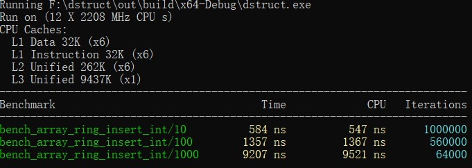
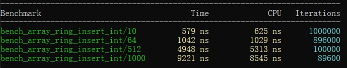

上一篇中初步体验了google benchmark的使用，本文将进一步深入了解google benchmark的常用方法。

## 向测试用例传递参数

之前我们的测试用例都只接受一个`benchmark::State&`类型的参数，如果我们需要给测试用例传递额外的参数呢？

举个例子，加入我们需要实现一个队列，现有`ring buffer`和`linked list`两种实现可选，现在我们要测试两种方案在不同情况下的性能表现：

```cpp
// 必要的数据结构
#include "ring.h"
#include "linked_ring.h"
 
// ring buffer的测试
static void bench_array_ring_insert_int_10(benchmark::State& state)
{
    auto ring = ArrayRing<int>(10);
    for (auto _: state) {
        for (int i = 1; i <= 10; ++i) {
            ring.insert(i);
        }
        state.PauseTiming(); // 暂停计时
        ring.clear();
        state.ResumeTiming(); // 恢复计时
    }
}
BENCHMARK(bench_array_ring_insert_int_10);
 
// linked list的测试
static void bench_linked_queue_insert_int_10(benchmark::State &state)
{
    auto ring = LinkedRing<int>{};
    for (auto _:state) {
        for (int i = 0; i < 10; ++i) {
            ring.insert(i);
        }
        state.PauseTiming();
        ring.clear();
        state.ResumeTiming();
    }
}
BENCHMARK(bench_linked_queue_insert_int_10);
 
// 还有针对删除的测试，以及针对string的测试，都是高度重复的代码，这里不再罗列
```

很显然，上面的测试出了被测试类型和插入的数据量之外没有任何区别，如果可以通过传入参数进行控制的话就可以少写大量重复的代码。

编写重复的代码是浪费时间，而且往往意味着你在做一件蠢事，google的工程师当然早就注意到了这一点。虽然测试用例只能接受一个`benchmark::State&`类型的参数，但是我们可以将参数传递给state对象，然后再测试用例中获取：

```cpp
static void bench_array_ring_insert_int(benchmark::State& state)
{
    auto length = state.range(0);
    auto ring = ArrayRing<int>(length);
    for (auto _: state) {
        for (int i = 1; i <= length; ++i) {
            ring.insert(i);
        }
        state.PauseTiming();
        ring.clear();
        state.ResumeTiming();
    }
}
BENCHMARK(bench_array_ring_insert_int)->Arg(10);
```

上面的例子展示了如果传递和获取参数：

1. 传递参数使用`BENCHMARK`宏生成的对象的`Arg`方法
2. 传递进来的参数会被放入到`state`对象内部存储，通过`range`方法获取，调用时的参数0是传入参数的需要，对应第一个参数

`Arg`方法一次只能传递一个参数，如果一次想要传递多个参数呢？也很简单：

```cpp
static void bench_array_ring_insert_int(benchmark::State& state)
{
    auto ring = ArrayRing<int>(state.range(0));
    for (auto _: state) {
        for (int i = 1; i <= state.range(1); ++i) {
            ring.insert(i);
        }
        state.PauseTiming();
        ring.clear();
        state.ResumeTiming();
    }
}
BENCHMARK(bench_array_ring_insert_int)->Args({10, 10});
```

上面的例子没什么实际意义，只是为了演示如何传递多个参数，`Args`方法接受一个`vector`对象，所以我们可以使用C++11提供的大括号初始化器简化代码，获取参数依然通过`state.range`方法，1对应传递进来的第二个参数。

## 简化多个类似测试用例的生成

向测试用例传递参数的最终目的是为了在不编写重复代码的情况下生成多个测试用例，在知道了如何传递参数后你可能会这么写：

```cpp
static void bench_array_ring_insert_int(benchmark::State& state)
{
    auto length = state.range(0);
    auto ring = ArrayRing<int>(length);
    for (auto _: state) {
        for (int i = 1; i <= length; ++i) {
            ring.insert(i);
        }
        state.PauseTiming();
        ring.clear();
        state.ResumeTiming();
    }
}
// 下面我们生成测试插入10，100，1000次的测试用例
BENCHMARK(bench_array_ring_insert_int)->Arg(10);
BENCHMARK(bench_array_ring_insert_int)->Arg(100);
BENCHMARK(bench_array_ring_insert_int)->Arg(1000);
```

这里生成了三个实例，会产生下面的结果：



看起来工作良好，是吗？

没错，结果是正确的，但是记得我们前面说过的——*不要编写重复的代码*！是的，上面的手动编写了用例的生成，出现了可以避免的重复。

幸好`Arg`和`Args`会将我们的测试用例使用的参数进行注册以便产生用例名/参数的新测试用例，并且返回一个指向`BENCHMARK`宏生成对象的指针，换句话说，如果我们想要生成仅仅是参数不同的多个测试的话，只需要链式调用`Arg`和`Args`即可：

```cpp
BENCHMARK(bench_array_ring_insert_int)->Arg(10)->Arg(100)->Arg(1000);
```

结果和上面一样。

这还不是最优解，我们仍然重复调用了`Arg`方法，如果我们需要更多用例时就不得不又要重复劳动了。

对策google benchmark也有解决方法：我们可有使用`Range`方法来生成一定范围内的参数。

先看看`Range`的原型：

```cpp
BENCHMAEK(func)->Range(int64_t start, int64_t limit);
```

`start`表示参数范围起始的值，`limit`表示范围结束的值，`Range`所作用于的是一个“闭区间”。

```cpp
BENCHMARK(bench_array_ring_insert_int)->Range(10, 1000);
```



为什么会这样呢？那是因为`Range`默认除了`start`和`limit`，中间的其余参数都会是某一个base的幂，base默认为8，所以我们会看到64和512，他们分别是平方和立方。

想要改变这一行为也很简单，只要重新设置base即可，通过`RangeMultiplier`方法：

```cpp
BENCHMARK(bench_array_ring_insert_int)->RangeMultiplier(10)->Range(10, 1000);
```

现在结果就正确了。

使用Ranges可以处理多个参数的情况：

```cpp
BENCHMARK(func)->RangeMultiplier(10)->Ranges({{10, 1000}, {128， 256}});
```

第一个范围指定了测试用例的第一个传入参数的范围，而第二个范围指定了第二个传入参数可能的值（注意这里不是范围）。

与下面的代码等价：

```cpp
BENCHMARK(func)->Args({10, 128})
               ->Args({100, 128})
               ->Args({1000, 128})
               ->Args({10, 256})
               ->Args({100, 256})
               ->Args({1000, 256})
```

实际上就是用生成的第一个参数的范围与后面指定内容的参数做了一个笛卡尔积。

## 使用参数生成器

如果我想定制没有规律的更复杂的参数呢？这时就需要实现自定义的参数生成器了。

一个参数生成器的签名如下：

```cpp
void CustomArguments(benchmark::internal::Benchmark* b);
```

我们在生成器中计算出参数，然后调用`benchmark::internal::Benchmark`对象的`Arg`或`Args`方法像上两节那样传入参数即可。

随后我们使用`Apply`方法把生成器应用到测试用例上：

```cpp
BENCHMARK(func)->Apply(CustomArguments);
```

其实这一过程的原理并不复杂，做个简单的解释：

1. `BENCHMARK`宏产生的就是一个`benchmark::internal::Benchmark`对象然后返回了它的指针
2. 向`benchmark::internal::Benchmark`对象传递参数需要使用`Arg`和`Args`等方法
3. `Apply`方法会将参数中的函数应用在自身
4. 在生成器里使用`benchmark::internal::Benchmark`对象的指针b的Args等方法传递参数，这时的b其实指向我们的测试用例

到此为止生成器是如何工作的已经一目了然了，当然从上面得出的结论，我们还可以让Apply做更多的事情。

下面看下Apply的具体使用：

```cpp
// 这次我们生成100，200，...，1000的测试用例，用range是无法生成这些参数的
static void custom_args(benchmark::internal::Benchmark* b)
{
    for (int i = 100; i <= 1000; i += 100) {
        b->Arg(i);
    }
}
 
BENCHMARK(bench_array_ring_insert_int)->RangeMultiplier(10)->Apply(custom_args);
```

自定义参数的测试结果：


至此向测试用例传递参数的方法就全部介绍完了。