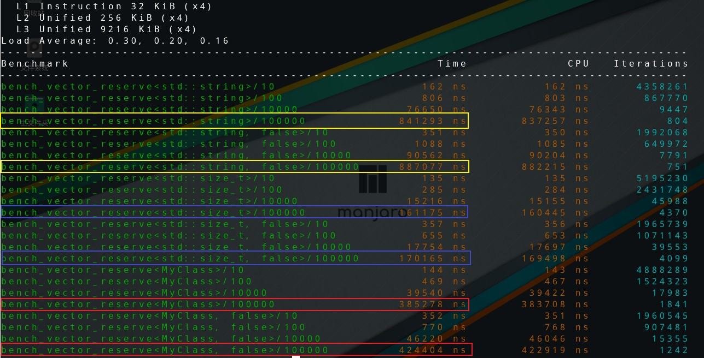

本文将会介绍如何使用模板以及参数生成器来批量生成测试用例，简化繁琐的性能测试代码。

## 测试对象

这次测试的对象是标准的vector，我们在Linux GCC上进行测试。为了写代码方便，开启了C++17的支持。

这次的疑问来自于《A Tour of C++》这本书，在第九章给出了一个很有意义的建议：尽量少用reserve方法。

我们都知道reserve会提前分配足够大的内存来容纳元素，这样在push_back时可以减少内存分配和元素移动的次数，从而提高性能。所以习惯上如果我们知道vector中存储元素的大致数量，就会使用reserve提前进行内存分配，这时典型的“空间换时间”。

而书中给出的理由仅仅是说vector的内存分配器性能已经很高，预分配往往是多此一举，收效甚微。事实到底如何呢？性能问题光靠脑补是不能定位的，所以我们用实验结果说话。

## 使用模板函数生成测试

测试用例的设计很简单，我们定义普通vector和reserve过的vector，然后分别对其添加一定数量的元素（逐步从少到多）测试性能。同时vector本身是泛型容器，所以为了测试的全面性我们需要测试两至三种类型参数。

如果针对每一种情况写测试函数，显然违反了DRY原则，因为除了vector的类型参数不同，其他代码几乎是完全一样的。

对于上面的需求，就需要模板测试函数登场了：

```cpp
template <typename T, std::size_t length, bool is_reserve = true>
void bench_vector_reserve(benchmark::State& state)
{
	for (auto _ : state) {
		std::vector<T> container;
		if constexpr (is_reserve) {
			container.reserve(length);
		}
		for (std::size_t i = 0; i < length; ++i) {
			container.push_back(T{});
		}
	}
}
```

非常的简单，我们通过length控制插入的元素个数；is_reserve则负责控制是否预分配内存，通过if constexpr可以生成reserve和不进行任何操作的两种代码（C++17的constexpr，推荐来[这里](https://www.cnblogs.com/apocelipes/p/14536236.html#%E4%BD%BF%E7%94%A8%E7%BC%96%E8%AF%91%E6%9C%9F%E6%9D%A1%E4%BB%B6%E5%88%86%E6%94%AF)）。

然后我们像往常一样定义一个测试用例：

```cpp
BENCHMARK(bench_vector_reserve<std::string,100>);
```

可是等我们编译的时候却报错了！

```cpp
$ g++ test.cpp -lpthread -lbenchmark -lbenchmark_main
 
test.cpp:19:48: 错误：宏“BENCHMARK”传递了 2 个参数，但只需要 1 个
   19 | BENCHMARK(bench_vector_reserve<std::string,100>);
      |                                                ^
In file included from a.cpp:1:
/usr/local/include/benchmark/benchmark.h:1146: 附注：macro "BENCHMARK" defined here
 1146 | #define BENCHMARK(n)                                     \
      | 
test.cpp:19:1: 错误：‘BENCHMARK’不是一个类型名
   19 | BENCHMARK(bench_vector_reserve<std::string,100>);
```

原因是这样的，在编译器处理宏的时候实际上不会考虑C++语法，所以分割模板参数的都好被识别成了分割宏参数的都好，因此在宏处理的眼里我们像是传了两个参数。这也说明了BENCHMARK是处理不了模板的。

不过别担心，Google早就想到这种情况了，所以提供了BENCHMARK_TEMPLATE宏，我们只需要把模板名字和需要的类型参数一次传给宏即可：

```cpp
BENCHMARK_TEMPLATE(bench_vector_reserve, std::string, 100);
BENCHMARK_TEMPLATE(bench_vector_reserve, std::string, 1000);
BENCHMARK_TEMPLATE(bench_vector_reserve, std::string, 10000);
BENCHMARK_TEMPLATE(bench_vector_reserve, std::string, 100000);
BENCHMARK_TEMPLATE(bench_vector_reserve, std::string, 100, false);
BENCHMARK_TEMPLATE(bench_vector_reserve, std::string, 1000, false);
BENCHMARK_TEMPLATE(bench_vector_reserve, std::string, 10000, false);
BENCHMARK_TEMPLATE(bench_vector_reserve, std::string, 100000, false);
```

现在就可以正常编译运行了：

```bash
2022-05-11T22:46:08+08:00
Running ./a.out
Run on (24 X 3800 MHz CPU s)
CPU Caches:
  L1 Data 32 KiB (x12)
  L1 Instruction 32 KiB (x12)
  L2 Unified 512 KiB (x12)
  L3 Unified 16384 KiB (x4)
Load Average: 2.35, 2.14, 2.08
-------------------------------------------------------------------------------------------
Benchmark                                                 Time             CPU   Iterations
-------------------------------------------------------------------------------------------
bench_vector_reserve<std::string, 100>                10585 ns        10582 ns        66709
bench_vector_reserve<std::string, 1000>              105281 ns       105259 ns         6294
bench_vector_reserve<std::string, 10000>            1042131 ns      1041909 ns          668
bench_vector_reserve<std::string, 100000>          10522072 ns     10519683 ns           66
bench_vector_reserve<std::string, 100, false>         19668 ns        19664 ns        35544
bench_vector_reserve<std::string, 1000, false>       171773 ns       171729 ns         4092
bench_vector_reserve<std::string, 10000, false>     2073056 ns      2072603 ns          337
bench_vector_reserve<std::string, 100000, false>   19777850 ns     19771465 ns           35
```

可以看到reserve过的容器性能几乎比默认的快了一倍。

不过在揭晓为什么书上不推荐reserve的谜底之前，我们的代码还有可以简化的地方。

## 定制测试参数

首当其冲的问题其实还是违反了DRY原则——除了数字，其他内容都是重复的。

看到这种代码直觉就告诉我该做些改进了。

首先我们来复习一下，在前一篇中我们已经学习过它了，Range接受start和end两个int64_t类型的参数，默认从start起每次累乘8，一直达到end。

通过RangeMultiplier我们可以改变乘数，比如从8变成10.

在这里我们的length参数其实是不必要的，所以代码可以这样改：

```cpp
template <typename T, bool is_reserve = true>
void bench_vector_reserve(benchmark::State& state)
{
	for (auto _ : state) {
		std::vector<T> container;
		if constexpr (is_reserve) {
            // 通过range方法获取传入的参数
			container.reserve(state.range(0));
		}
		for (std::size_t i = 0; i < state.range(0); ++i) {
			container.push_back(T{});
		}
	}
}
 
BENCHMARK_TEMPLATE(bench_vector_reserve, std::string)->RangeMultiplier(10)->Range(10, 10000 * 10);
BENCHMARK_TEMPLATE(bench_vector_reserve, std::string, false)->RangeMultiplier(10)->Range(10, 10000 * 10);
```

现在我们测试的元素数量是{10, 100, 1000, 10^4, 10^5}。

除此之外还有另一种叫”密集参数“的Ranges。google benchmark提供了DenseRange方法。

这个方法的原型如下：

```cpp
DenseRange(int64_t start, int64_t end, int64_t step);
```

Range是累乘，而DenseRange是累加，因为累乘会导致几何级数的增长，在数轴上的分布越来越稀疏，累加则看上去像是均匀分布的，因此累加的参数生成器被叫做密集参数生成器。

如果我们把测试用例这么该：

```cpp
BENCHMARK_TEMPLATE(bench_vector_reserve, std::string)->DenseRange(1000, 100 * 100, 1000);
```

现在我们的length就是这样一个序列：{1000, 2000, 3000, ..., 9000, 10000}。

关于自定义参数最后一个知识点是ArgsProduct。看名字就知道这时一个参数工厂。

```cpp
ArgsProduct(const std::vector< std::vector<int64_t> >& arglists);
```

`std::vector<int64_t>`实际上就是一组参数，`arglists`就是多组参数的合集，他们之间会被求笛卡尔积，举个例子：

```cpp
BENCHMARK(BM_test)->ArgsProduct({ {"a", "b", "c", "d"}, {1, 2, 3, 4} });
 
// 等价于下面的
BENCHMARK(BM_test)->Args({"a", 1})
                  ->Args({"a", 2})
                  ->Args({"a", 3})
                  ->Args({"a", 4})
                  ->Args({"b", 1})
                  ->Args({"b", 2})
                  ->Args({"b", 3})
                  ...
                  ->Args({"d", 3})
                  ->Args({"d", 4})
```

我们可以看到参数工厂其实得自己手写所有参数，那如果我想配合工厂使用Ranges呢？

没问题，benchmark的开发者们早就想到了，所以提供了下面这些帮助函数：

```cpp
benchmark::CreateRange(8, 128, /*multi=*/2)   // 生成：[8, 16, 32, 64, 128]
benchmark::CreateDenseRange(1, 6, /*step=*/1) // 生成：[1, 2, 3, 4, 5, 6]
```

换成我们这边的例子，就可以这样写：

```cpp
BENCHMARK_TEMPLATE(bench_vector_reserve, std::string)->ArgsProduct({
    benchmark::CreateRange(10, 10000*10, 10)
});
BENCHMARK_TEMPLATE(bench_vector_reserve, std::string, false)->ArgsProduct({
    benchmark::CreateRange(10, 10000*10, 10)
});
```

借助仅仅两行代码就能生成数量可观的测试用例：

```bash
2022-05-12T10:58:08+08:00
Running ./a.out
Run on (24 X 3800 MHz CPU s)
CPU Caches:
  L1 Data 32 KiB (x12)
  L1 Instruction 32 KiB (x12)
  L2 Unified 512 KiB (x12)
  L3 Unified 16384 KiB (x4)
Load Average: 1.88, 2.08, 2.07
***WARNING*** CPU scaling is enabled, the benchmark real time measurements may be noisy and will incur extra overhead.
------------------------------------------------------------------------------------------
Benchmark                                                Time             CPU   Iterations
------------------------------------------------------------------------------------------
bench_vector_reserve<std::string>/10                  1329 ns         1329 ns       553853
bench_vector_reserve<std::string>/100                11071 ns        11068 ns        67213
bench_vector_reserve<std::string>/1000              107722 ns       107686 ns         6361
bench_vector_reserve<std::string>/10000            1071972 ns      1071554 ns          637
bench_vector_reserve<std::string>/100000          10821865 ns     10815148 ns           63
bench_vector_reserve<std::string, false>/10           2791 ns         2790 ns       247312
bench_vector_reserve<std::string, false>/100         19788 ns        19777 ns        35436
bench_vector_reserve<std::string, false>/1000       170198 ns       170146 ns         4221
bench_vector_reserve<std::string, false>/10000     2063908 ns      2062654 ns          341
bench_vector_reserve<std::string, false>/100000   19086785 ns     19077179 ns           37
```

当然，这只是一个类型参数，实际上我们还有另外两个类型需要测试。

## 揭晓答案

实际上上面测试的都是我们明确知道vector一定会被插入N个元素不多不少的情况。

然而这种情况其实在开发中是不多见的，更多的时候我们只能得到vector里元素数量的平均数、众数，甚至是一个没什么可靠依据的经验值。

所以试想一下这种情况，reserve给的参数是1000，而我的vector总是会插入1001~1005个参数，显然1000是不够的，除了reserve外还会进行一次内存分配，而且这次分配后很可能还需要把原来的元素都转移过去（realloc不是总能找到合适的位置扩展已有内存），这样子的开销究竟有多大，我们来修改测试一下：



## 总结

我们学习了如何使用模板和参数生成器创建大量测试用例，以提高编写测试的效率。

我们还顺便了解了vector.reserve对性能的影响，总结规律有几条：

1. 如果明确知道vector要存放元素的具体数量，推荐reserve，性能提升是有目共睹的；
2. 否则你不应该使用reserve，一来有提前优化之嫌，二是在使用libstdc++的程序上会产生较大的性能波动；
3. 接上一条，reserve使用不当还会造成内存的浪费。

看来《A Tour of C++》的作者只说对了一半，这也证明了性能问题不能靠臆断，一定要靠测试来定位、解决。