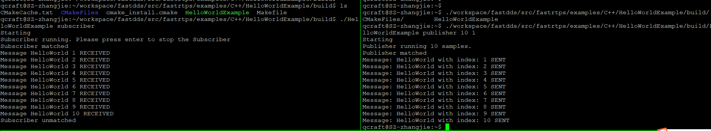
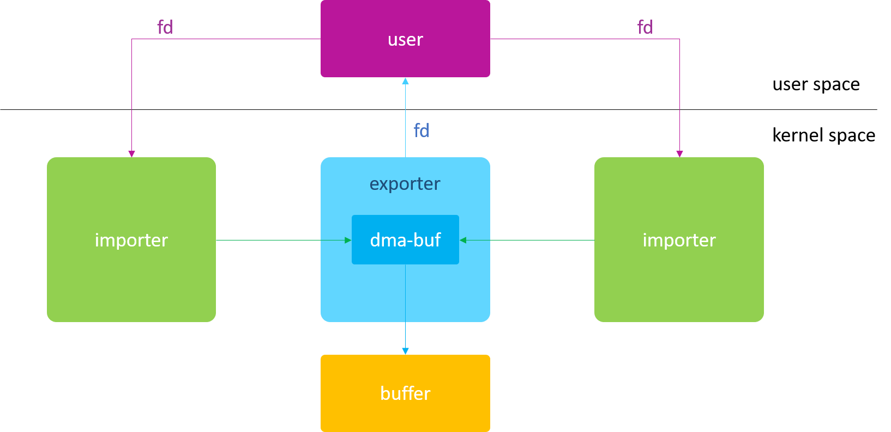

## 写在前面

目前正在往自动驾驶的方向上走，目前公司用的底层通信框架还比较粗暴、稚嫩，这里参考一些开源的框架来学习，看能否对改造现有方案起到作用，也是为了记录自己的一些学习过程，以免后面想要回过头来做参考。

## 简单介绍

FastDDS也是目前比较好的一个框架，FastDDS是由位于西班牙马德里的eProsima公司推出的免费开源DDS中间件解决方案，并提供支付技术支持服务。它的源码基于C++，规范基于OMG DDS 1.4 and the OMG RTPS 2.2。

这里先介绍一下依照官方如何安装FastDDS到系统，并进行简单的测试。

官方文档链接：[https://fast-dds.docs.eprosima.com/en/latest/](https://fast-dds.docs.eprosima.com/en/latest/)，这里出了安装步骤，还有很多原理和例程介绍。

这里是使用的操作系统是ubuntu 1804进行安装。

**FastDDS的安装内容主要有三部分：**

- **FastDDS library**
    - foonathan_memory_vendor: C++内存分配库
    - fastdcdr: CDR序列化(serialization)机制
    - fastrtps: FastDDS核心库
- **FastDDS Python bindings(可选)**
- **FastDDS Gen**
    - 从IDL文件生成源代码工具，基于Java程序。由IDL文件中定义的data type生成代码的脚本工具。

### 1. 安装FastDDS Library

**安装依赖**

```powershell
sudo apt install cmake g++ python3-pip wget git
sudo apt install libasio-dev libtinyxml2-dev
sudo apt install libssl-dev

libp11 and HSM libs:
//sudo apt install libp11-dev libengine-pkcs11-openssl (可选，只有DDS用到security和PKCS#11 URI时才需要，我没装)
//sudo apt install softhsm2 （可选，我没装，装了libp11-dev才需要）
//sudo usermod -a -G softhsm <user> （可选，我没装，同上）
//sudo apt install libengine-pkcs11-openssl （同上）
//p11-kit list-modules（同上）
//openssl engine pkcs11 -t（同上）

Gtest: 可选，C++单元测试库，我还没装
//git clone https://github.com/google/googletest src/googletest-distribution
```

**使用colcon安装FastDDS库**

1. 安装colcon，vcstool
    
    ```powershell
    pip3 install -U colcon-common-extensions vcstool
    ```
    
2. 把repos下载下来，为后面的vcs import做准备
    
    ```powershell
    mkdir ~/Fast-DDS
    cd ~/Fast-DDS
    wget https://raw.githubusercontent.com/eProsima/Fast-DDS/master/fastrtps.repos
    ```
    
3. 把repos的内容导入src文件夹
    
    ```powershell
    mkdir src
    vcs import src < fastrtps.repos
    ```
    
    这里有可能会遇到vcs工具无法识别的问题，可以去`~/.local/bin/`目录下找找看
    
4. 编译package
    
    ```powershell
    colcon build
    ```
    
    安装完之后可以再install目录下找到生成的头文件和和库
    
    ```powershell
    qcraft@SZ-zhangjie:~/workspace/fastdds/install$ ls
    COLCON_IGNORE  fastrtps                 local_setup.bash  local_setup.sh            _local_setup_util_sh.py  setup.bash  setup.sh
    fastcdr        foonathan_memory_vendor  local_setup.ps1   _local_setup_util_ps1.py  local_setup.zsh          setup.ps1   setup.zsh
    ```
    
    这里有个`setup.bash`的脚本，可以自动配置开发需要的环境，可以把它加到`.bashrc`中
    
    ```powershell
    echo 'source ~/Fast-DDS/install/setup.bash' >> ~/.bashrc
    ```
    

### 2. 安装FastDDS-Gen

> 链接：[https://fast-dds.docs.eprosima.com/en/latest/installation/sources/sources_linux.html#fast-dds-gen-installation](https://fast-dds.docs.eprosima.com/en/latest/installation/sources/sources_linux.html#fast-dds-gen-installation)
> 

安装Java JDK:

```powershell
sudo apt install openjdk-8-jdk
```

进入到fastddsgen源码目录下，执行gradle编译

```powershell
cd fastddsgen/
./gradlew assemble
```

等待安装完成，可以再scripts目录下找到fastddsgen命令

## 编译/运行HelloWorldExample

进入到ddsrtps目录下，找到对应的`HelloWorldExample`，使用cmake进行编译

```powershell
cd src/fastrtps/examples/C++/HelloWorldExample
mkdir build
cd build
cmake ..
make
```

编译成功可以找到目录下的`HelloWorldExample`可执行程序，因为之前有运行过`setup.bash`来配置过环境，所以可以顺利进行编译和运行，结果如下：



可以正常的发布和订阅数据。