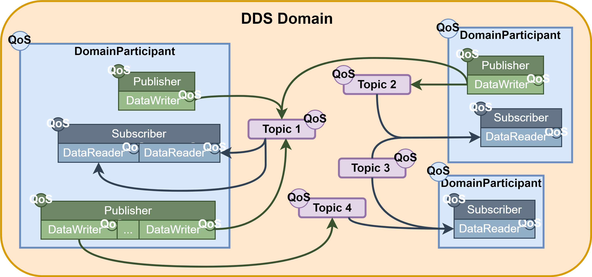
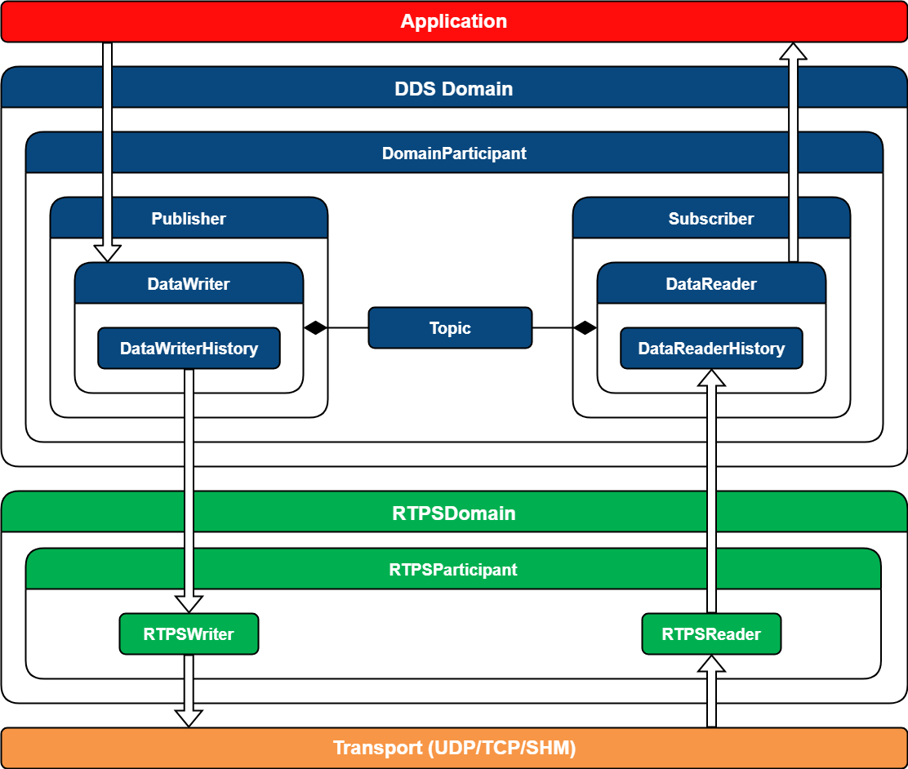
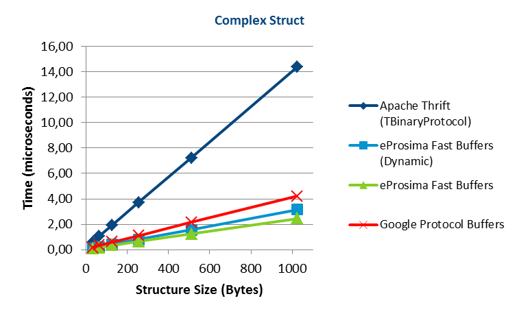
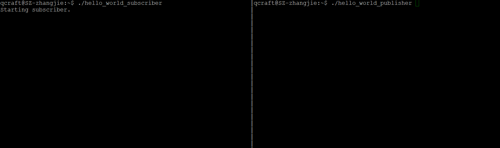
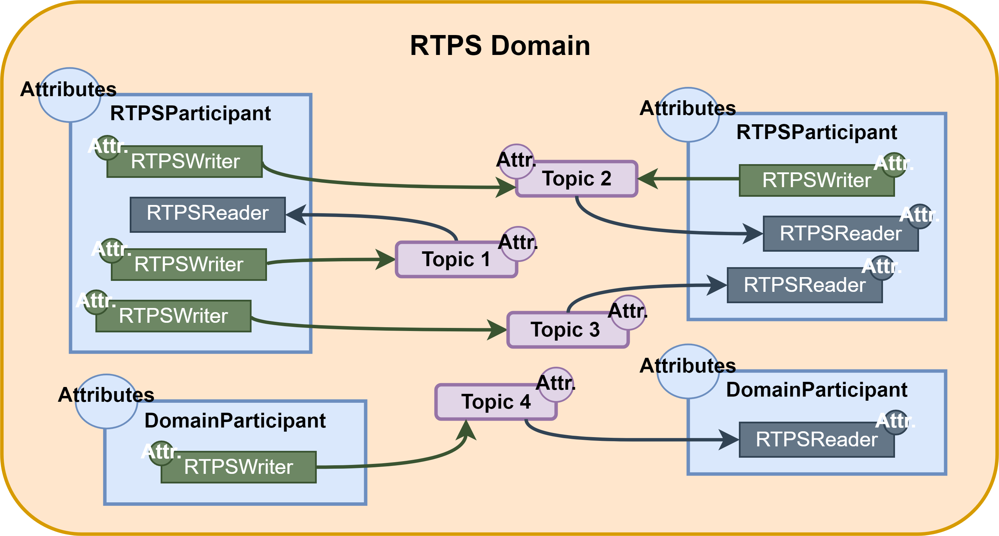

本篇是搬运自官方文档：

[1. Getting Started — Fast DDS 2.6.0 documentation (eprosima.com)](https://fast-dds.docs.eprosima.com/en/latest/fastdds/getting_started/getting_started.html)

以及加入了自己的实践，会比较偏实战，减去很多理论的东西，很多理论的东西翻译不过来，见谅，想要深入理解原理的话，可以进入链接自行查看，

## 什么是DDS?

DDS：[Data Distribution Service](https://www.omg.org/spec/DDS/About-DDS/)（数据分发服务），是由对象管理组织（OMG®）发布和维护，是一个中间件协议和API标准，采用发布/订阅体系架构，强调以数据为中心，提供丰富的QoS服务质量策略，以保障数据进行实时、高效、灵活的分发，可满足各种分布式实时通信应用需求。

而我们这里的Fast DDS是DDS规范的C++实现，Fast DDS的前称是Fast RTPS，目前ROS2将Fast DDS作为默认的DDS中间件实现。

DDS标准和相关版本信息可以参考下面链接：

[DDS 介绍 (qq.com)](https://mp.weixin.qq.com/s?__biz=MzI0NTU1NDQ3Mw==&mid=2247483781&idx=1&sn=652b3ae8b7e02df26f75d3cfa29962e9&chksm=e94d8dc3de3a04d593744162722b5cd24c1b51b211f5eedf2e0aa229dac7481a16f50d3c7179&scene=21#wechat_redirect)

## DDS API

DDS采用的通信模型是一种多对多单项数据交换，其中产生数据的应用程序将数据发布到属于使用数据的应用程序的订阅者的本地缓存。信息流由负责数据交换的尸体之间简历的服务质量（QoS）策略来控制。

作为一个以数据为中心的模型，DDS简历在所有感兴趣的应用程序都可以访问的“全局数据空间”的概念之上。提供信息的应用程序作为发布者，访问部分数据空间的应用程序作为订阅者。每当发布者向该空间发布新数据时，中间件就将该信息传播给所有感兴趣的订阅者。

通信发生在多个域之间，既链接所有能够相互通信的分布式应用程序的鼓励抽象平面。只有属于同一个域的实体才能进行交互，订阅数据的实体和发布数据的实体之间的匹配通过主题进行中介。主题是明确的标识符，它将在域中唯一的名称与数据类型和一组附加的特定于数据的QoS相关联。

DDS实体被建模为类或类型化接口，后者意味着更有效的资源处理，因为在执行前了解数据类型允许提前分配内存，而不是动态分配。



## Fast DDS-Gen

依赖接口意味着需要一个生成工具，将类型描述转换为适当的实现，以填补接口和中间件之间的空白。这个任务由生成工具`Fast DDS-Gen`完成，这时一个Java应用程序，前一篇也提到了如何生成这样一个工具，它使用接口定义语言（IDL）文件中定义的数据类型生成源代码。

## 什么是Fast RTPS

Fast DDS在标准网络上交换信息，所使用的协议是实时发布-订阅协议（RTPS），这时由OMG联盟定义和维护的用于DDS的互操作性有线协议。该协议通过TCP/UDP/IP等传输协议提供发布者-订阅者通信，并保证不同DDS实现之间的兼容性。

由于RTPS协议的发布-订阅和它的规范是为满足DDS应用程序域所解决的相同需求而设计的，因此RTPS协议映射到许多DDS概念中。所有RTPS核心实体都与一个RTPS域相关联，该域表示一个断点匹配的隔离通信平面。RTPS协议中指定的实体与DDS实体一一对应，因此允许通信发生。



- **实时性**：提供可配置的实时功能，保证在指定的时间限制内响应；
- **服务发现**：内置基于对现有发布者和订阅者的动态发现，并且不需要联系或者设置任何服务器就可以持续执行此任务，同时也支持配置其他发现机制；
- **支持同步和异步数据发布模式**；
- **传输层**：实现了可插拔的体系结构，当前版本支持五种传输：UDPv4、UDPv6、TCPv4、TCPv6和SHM(共享内存)；
- **安全性**：提供可配置的安全通信，实现了可插拔的安全配置，包括：远程参与者的身份验证、实体的访问控制和数据加密；
- **即插即用连接**：新的应用程序和服务能够自动发现，可以再任何时候加入或离开网络，而不需要重新配置；
- **可伸缩性和灵活性**：DDS建立在全局数据空间的概念之上，中间件负责在发布者和订阅者之间传播信息，这使得分布式网络可以适应重新配置，并可扩展大量实体；
- **可移植性**：DDS规范包括到IDL的特性平台映射，允许使用DDS的应用程序只需重新编译就可以再DDS实现之间切换；
- **可扩展性**：允许使用新的服务扩展和增强协议，不会破坏向后兼容性和互操作性；
- **可配置性和模块化**：提供了一种通过代码或XML配置文件进行配置的直观方式。模块化允许简单设备实现协议的子集，同时仍然参与网络；
- **高性能序列化**：基于eProsima的Fast Buffers序列化，官网说其性能高于Protocol Buffers和Thrift：



- **低资源的消耗**：允许预分配资源，减少动态资源分配，避免无限制使用资源，最小化数据复制的需要；
- **多平台**：默认情况下，该项目可以再Linux、Windows和MacOS上运行；
- **免费和开源**：Fast DDS库、Fast RTPS库、Fast DDS-Gen、内部依赖项（如Fast CDR）和外部依赖项（如foonathan库）都是免费和开源的；

## 简单的C++ 发布和订阅者

官方使用的是CMake来构建整个项目，在前面一篇文章中，已经把Fast DDS安装好了，生成了开发所需的库和头文件，所以这里其实就是把库和头文件通过CMake来构建，我这里已经移植到Bazel里面来构建整个项目了，这里以Bazel为例，其实CMake的话，官方源代码里面的Example已经实现了，简单参考即可。

所以这里分为发布者和订阅者，这里需要自己编写的代码为：

```powershell
.
├── HelloWorld.idl
├── hello_world_publisher.cc
└── hello_world_subscriber.cc
```

这里可以看到，我习惯于用下划线来分割单词命名，但是fastddsgen工具生成的代码是以驼峰式命名的方式的，所以这里idl文件以驼峰式命名了。

用来构建项目的步骤这里就跳过了。

### 1. 建立Topic的数据类型

使用Fast DDS-Gen应用程序来生成源代码，这里需要编写IDL文件：

- 为自定义topic生成C++定义
- 为自定义topic生成C++函数类

```powershell
struct HelloWorld
{
  unsigned long index;
  string message;
};
```

使用fastddsgen命令自动生成源代码：

```powershell
example/fastdds/hello_world$ fastddsgen HelloWorld.idl
openjdk version "11.0.14.1" 2022-02-08
OpenJDK Runtime Environment (build 11.0.14.1+1-Ubuntu-0ubuntu1.18.04)
OpenJDK 64-Bit Server VM (build 11.0.14.1+1-Ubuntu-0ubuntu1.18.04, mixed mode, sharing)
Loading templates...
Processing the file HelloWorld.idl...
Generating Type definition files...
Generating TopicDataTypes files...
Adding project: HelloWorld.idl
```

目录下多出来了几个生成的代码：

```powershell
.
├── HelloWorld.cxx
├── HelloWorld.h
├── HelloWorld.idl
├── hello_world_publisher.cc
├── HelloWorldPubSubTypes.cxx
├── HelloWorldPubSubTypes.h
└── hello_world_subscriber.cc
```

注意，生成的代码也需要加入到代码构建中。

### 2. 编写发布者代码

```cpp
#include "HelloWorldPubSubTypes.h"

#include <fastdds/dds/domain/DomainParticipantFactory.hpp>
#include <fastdds/dds/domain/DomainParticipant.hpp>
#include <fastdds/dds/topic/TypeSupport.hpp>
#include <fastdds/dds/publisher/Publisher.hpp>
#include <fastdds/dds/publisher/DataWriter.hpp>
#include <fastdds/dds/publisher/DataWriterListener.hpp>

using namespace eprosima::fastdds::dds;

class HelloWorldPublisher {
 private:
  HelloWorld hello_;
  
  DomainParticipant* participant_;

  Publisher* publisher_;

  Topic* topic_;

  DataWriter* writer_;

  TypeSupport type_;

  class PubListener : public DataWriterListener {
   public:
    PubListener() : matched_(0) {}
    
    ~PubListener() override {}

    void on_publication_matched(DataWriter* writer,
        const PublicationMatchedStatus& info) override {
      if(info.current_count_change == 1) {
        matched_ = info.total_count;
        std::cout << "Publisher matched." << std::endl;
      } else if(info.current_count_change == -1) {
        matched_ = info.total_count;
        std::cout << "Publisher unmatched." << std::endl;
      } else {
        std::cout << info.current_count_change
                  << " is not a valid value for PublicationMatchedStatus current count change."
                  << std::endl;
      }
    }

    std::atomic_int matched_;
  } listener_;

 public:
  HelloWorldPublisher()
      : participant_(nullptr)
      , publisher_(nullptr)
      , topic_(nullptr)
      , writer_(nullptr)
      , type_(new HelloWorldPubSubType()) {}

  virtual ~HelloWorldPublisher() {
    if(writer_ != nullptr) {
      publisher_->delete_datawriter(writer_);
    }
    if(publisher_ != nullptr) {
      participant_->delete_publisher(publisher_);
    }
    if(topic_ != nullptr) {
      participant_->delete_topic(topic_);
    }
    DomainParticipantFactory::get_instance()->delete_participant(participant_);
  }

  // Initialize the publisher
  bool Init() {
    hello_.index(0);
    hello_.message("HelloWorld");

    DomainParticipantQos participantQos;
    participantQos.name("Participant_publisher");
    participant_ = DomainParticipantFactory::get_instance()->create_participant(0, participantQos);
    if(participant_ == nullptr) {
      return false;
    }

    // Register the type
    type_.register_type(participant_);

    // Create the publications Topic
    topic_ = participant_->create_topic("HelloWorldTopic", "HelloWorld", TOPIC_QOS_DEFAULT);
    if(topic_ == nullptr) {
      return false;
    }

    // Create the Publisher
    publisher_ = participant_->create_publisher(PUBLISHER_QOS_DEFAULT, nullptr);
    if(publisher_ == nullptr) {
      return false;
    }

    // Create the DataWriter
    writer_ = publisher_->create_datawriter(topic_, DATAWRITER_QOS_DEFAULT, &listener_);
    if(writer_ == nullptr) {
      return false;
    }
    return true;
  }

  bool Publish() {
    if(listener_.matched_ > 0) {
      hello_.index(hello_.index() + 1);
      writer_->write(&hello_);
      return true;
    }
    return false;
  }

  void Run(uint32_t samples) {
    uint32_t samples_sent = 0;
    while(samples_sent < samples) {
      if(Publish()) {
        samples_sent ++;
        std::cout << "Message: " << hello_.message() << " with index: " << hello_.index()
                   << " SENT" << std::endl;
      }
      std::this_thread::sleep_for(std::chrono::milliseconds(1000));
    }
  }
}; // class HelloWorldPublisher

int main(int argc, char** argv) {
  std::cout << "Starting publisher." << std::endl;
  int samples = 10;

  HelloWorldPublisher* mypub = new HelloWorldPublisher();
  if(mypub->Init()) {
    mypub->Run(static_cast<uint32_t>(samples));
  }

  delete mypub;
  return 0;
}
```

### 3. 分析代码

首先我们包含了下面这个头文件，这个文件中包含了我们自定义数据类型的序列化和反序列化的方法。

```cpp
#include "HelloWorldPubSubTypes.h"
```

下面的头文件是标准Fast DDS的API

- `**DomainParticipantFactory**`: 用来创建和销毁`DomainParticipant`对象
- `**DomainParticipant**`: 作为一个其他实体的一个容器和`Publisher`，`Subscriber` 和`Topic`对象的工厂
- `**TypeSupport**`: 为参与者提供了功能序列化、反序列化，得到一个特定的数据类型的key
- `**Publisher**`: 负责创建`DataWriters`的对象
- `**DataWriter**`: 允许应用程序通过`DataWriter`写入给定`Topic`的数据值
- `**DataWriterListener**`: 用来继承`DataWriterListern`

```cpp
#include <fastdds/dds/domain/DomainParticipantFactory.hpp>
#include <fastdds/dds/domain/DomainParticipant.hpp>
#include <fastdds/dds/topic/TypeSupport.hpp>
#include <fastdds/dds/publisher/Publisher.hpp>
#include <fastdds/dds/publisher/DataWriter.hpp>
#include <fastdds/dds/publisher/DataWriterListener.hpp>
```

下面声明了`namespace`，方便后面使用Fast DDS的API

```cpp
using namespace eprosima::fastdds::dds;
```

在`HelloWorldPublish`中声明的私有数据`hello_`成员数据是`HelloWorld`类型的声明，是从IDL文件生成的类。`type_`是`TypeSupport`类的对象，用来注册在`DomainParticipant`的`Topic`数据类型

```cpp
private:
  HelloWorld hello_;
  
  DomainParticipant* participant_;

  Publisher* publisher_;

  Topic* topic_;

  DataWriter* writer_;

  TypeSupport type_;
```

下面的`PubListener`类是`DataWriterListener`的子类，实现了listener的回调函数，用来监听一些事件。这里复写了`on_publication_matched(DataWriter *writer, const PublicationMatchedStatus &info)`

这个回调函数在发布者匹配到endpoint的时候会被触发。

```cpp
class PubListener : public DataWriterListener {
   public:
    PubListener() : matched_(0) {}
    
    ~PubListener() override {}

    void on_publication_matched(DataWriter* writer,
        const PublicationMatchedStatus& info) override {
      if(info.current_count_change == 1) {
        matched_ = info.total_count;
        std::cout << "Publisher matched." << std::endl;
      } else if(info.current_count_change == -1) {
        matched_ = info.total_count;
        std::cout << "Publisher unmatched." << std::endl;
      } else {
        std::cout << info.current_count_change
                  << " is not a valid value for PublicationMatchedStatus current count change."
                  << std::endl;
      }
    }

    std::atomic_int matched_;
  } listener_;
```

然后是`HelloWorldPublisher`类的构造和西沟函数，构造函数基本啥都没做，初始化了`type_`成员变量，析构函数用来释放私有成员的数据。

```cpp
HelloWorldPublisher()
      : participant_(nullptr)
      , publisher_(nullptr)
      , topic_(nullptr)
      , writer_(nullptr)
      , type_(new HelloWorldPubSubType()) {}

  virtual ~HelloWorldPublisher() {
    if(writer_ != nullptr) {
      publisher_->delete_datawriter(writer_);
    }
    if(publisher_ != nullptr) {
      participant_->delete_publisher(publisher_);
    }
    if(topic_ != nullptr) {
      participant_->delete_topic(topic_);
    }
    DomainParticipantFactory::get_instance()->delete_participant(participant_);
  }
```

然后是定义了`HelloWorldPublisher`类的成员函数

1. 初始化`hello_`成员变量，后面用它来做数据传输
2. 创建一个`DomainParticipantQos`，然后设置名称，然后通过`DomainParticipantFactory`的`create_participant`方法来创建`participant_`变量
3. 注册数据类型
4. 通过`participant_`来创建topic
5. 通过`participant_`来创建publisher
6. 通过`piblisherl_`来创建DataWriter

可以看到，Qos的配置是默认的值(`TOPIC_QOS_DEFAULT`, `PARTICIPANT_QOS_DEFAULT`, `PUBLISHER_QOS_DEFAULT`, `DATA_WRITER_QOS_DEFAULT`).

```cpp
// Initialize the publisher
  bool Init() {
    hello_.index(0);
    hello_.message("HelloWorld");

    DomainParticipantQos participantQos;
    participantQos.name("Participant_publisher");
    participant_ = DomainParticipantFactory::get_instance()->create_participant(0, participantQos);
    if(participant_ == nullptr) {
      return false;
    }

    // Register the type
    type_.register_type(participant_);

    // Create the publications Topic
    topic_ = participant_->create_topic("HelloWorldTopic", "HelloWorld", TOPIC_QOS_DEFAULT);
    if(topic_ == nullptr) {
      return false;
    }

    // Create the Publisher
    publisher_ = participant_->create_publisher(PUBLISHER_QOS_DEFAULT, nullptr);
    if(publisher_ == nullptr) {
      return false;
    }

    // Create the DataWriter
    writer_ = publisher_->create_datawriter(topic_, DATAWRITER_QOS_DEFAULT, &listener_);
    if(writer_ == nullptr) {
      return false;
    }
    return true;
  }
```

通过`writer_`的`write`方法来发布数据出去，可以看到下面的代码，只有当`listener_`的`matched>0`的时候，才去发布数据。

```cpp
bool Publish() {
    if(listener_.matched_ > 0) {
      hello_.index(hello_.index() + 1);
      writer_->write(&hello_);
      return true;
    }
    return false;
  }
```

最后是利用主程序，来发布10个数据出去：

```cpp
void Run(uint32_t samples) {
    uint32_t samples_sent = 0;
    while(samples_sent < samples) {
      if(Publish()) {
        samples_sent ++;
        std::cout << "Message: " << hello_.message() << " with index: " << hello_.index()
                   << " SENT" << std::endl;
      }
      std::this_thread::sleep_for(std::chrono::milliseconds(1000));
    }
  }
}; // class HelloWorldPublisher

int main(int argc, char** argv) {
  std::cout << "Starting publisher." << std::endl;
  int samples = 10;

  HelloWorldPublisher* mypub = new HelloWorldPublisher();
  if(mypub->Init()) {
    mypub->Run(static_cast<uint32_t>(samples));
  }

  delete mypub;
  return 0;
}
```

当我们运行这个程序的时候智辉打印出来“Starting publisher.”后面不会做任何事情，原因是没有subscriber的加入，也就不会触发到注册的回调函数，不满足`(listener_.matched_ > 0`条件，所以不会真正的把数据发布出去。

### 4. 编写订阅者代码

下面的应用程序会订阅`HelloWorld`的Topic，然后接收10个数据。

```cpp
#include "HelloWorldPubSubTypes.h"

#include <fastdds/dds/domain/DomainParticipantFactory.hpp>
#include <fastdds/dds/domain/DomainParticipant.hpp>
#include <fastdds/dds/topic/TypeSupport.hpp>
#include <fastdds/dds/subscriber/Subscriber.hpp>
#include <fastdds/dds/subscriber/DataReader.hpp>
#include <fastdds/dds/subscriber/DataReaderListener.hpp>
#include <fastdds/dds/subscriber/qos/DataReaderQos.hpp>
#include <fastdds/dds/subscriber/SampleInfo.hpp>

using namespace eprosima::fastdds::dds;

class HelloWorldSubscriber {
 private:
  DomainParticipant* participant_;

  Subscriber* subscriber_;

  Topic* topic_;

  DataReader* reader_;

  TypeSupport type_;

  class SubListener : public DataReaderListener {
   public:
    SubListener() : samples_(0) {}

    ~SubListener() override {}

    void on_subscription_matched(DataReader* reader,
        const SubscriptionMatchedStatus& info) override {
      if(info.current_count_change == 1) {
        std::cout << "Subscriber matched." << std::endl;
      } else if(info.current_count_change == -1) {
        std::cout << "Subscriber unmatched." << std::endl;
      } else {
        std::cout << info.current_count_change
                  << " is not a valid value for SubscriptionMatchedStatus current count change"
                  << std::endl;
      }
    }

    void on_data_available(DataReader* reader) override {
      SampleInfo info;
      if(reader->take_next_sample(&hello_, &info) == ReturnCode_t::RETCODE_OK) {
        if(info.valid_data) {
          samples_ ++;
          std::cout << "Message: " << hello_.message() << " with index: "
                    << hello_.index() << " RECEIVED." << std::endl;
        }
      }
    }

    HelloWorld hello_;

    std::atomic_int samples_;

  } listener_;

 public:
  HelloWorldSubscriber()
      : participant_(nullptr)
      , subscriber_(nullptr)
      , topic_(nullptr)
      , reader_(nullptr)
      , type_(new HelloWorldPubSubType()) {}

  virtual ~HelloWorldSubscriber() {
    if(reader_ != nullptr) {
      subscriber_->delete_datareader(reader_);
    }
    if(topic_ != nullptr) {
      participant_->delete_topic(topic_);
    }
    if(subscriber_ != nullptr) {
      participant_->delete_subscriber(subscriber_);
    }
    DomainParticipantFactory::get_instance()->delete_participant(participant_);
  }

  // Initialize the subscriber
  bool Init() {
    DomainParticipantQos participantQos;
    participantQos.name("Participant_subscriber");
    participant_ = DomainParticipantFactory::get_instance()->create_participant(0, participantQos);

    if(participant_ == nullptr) {
      return false;
    }

    // Register the type
    type_.register_type(participant_);

    topic_ = participant_->create_topic("HelloWorldTopic", "HelloWorld", TOPIC_QOS_DEFAULT);
    if(topic_ == nullptr) {
      return false;
    }

    // Create the Subscriber
    subscriber_ = participant_->create_subscriber(SUBSCRIBER_QOS_DEFAULT, nullptr);
    if(subscriber_ == nullptr) {
      return false;
    }

    // Create the DataReader
    reader_ = subscriber_->create_datareader(topic_, DATAREADER_QOS_DEFAULT, &listener_);
    if(reader_ == nullptr) {
      return false;
    }
    return true;
  }

  void Run(uint32_t samples) {
    while(listener_.samples_ < samples) {
      std::this_thread::sleep_for(std::chrono::milliseconds(100));
    }
  }
}; // class HelloWorldSubscriber

int main(int argc, char** argv) {
  std::cout << "Starting subscriber." << std::endl;
  int samples = 10;

  HelloWorldSubscriber* mysub = new HelloWorldSubscriber();
  if(mysub->Init()) {
    mysub->Run(static_cast<uint32_t>(samples));
  }
  delete mysub;
  return 0;
}
```

### 5. 分析代码

有了前面对`HelloWorldPublisher`的分析，这里可以看到`HelloWorldSubscriber`的代码大部分一致，我们来看一下差异部分，一个是`SubListener`继承了`DataReaderListener`，我们复写了`on_subscription_matched(DataReader*,**const** SubscriptionMatchedStatus& info)`，和前面一致，可以获取到对应数据类型匹配的事件回调。

```cpp
void on_subscription_matched(DataReader* reader,
        const SubscriptionMatchedStatus& info) override {
      if(info.current_count_change == 1) {
        std::cout << "Subscriber matched." << std::endl;
      } else if(info.current_count_change == -1) {
        std::cout << "Subscriber unmatched." << std::endl;
      } else {
        std::cout << info.current_count_change
                  << " is not a valid value for SubscriptionMatchedStatus current count change"
                  << std::endl;
      }
    }
```

还有一个最终要的回调函数`void on_data_available(DataReader* reader)`我们的订阅者就是通过这个回调函数来接收对应的数据类型的，当有时间发布出来的时候，这个回调函数会被执行到，其中调用到`reader`的`take_next_sample`函数来获取到订阅的数据和`SampleInfo`

```cpp
void on_data_available(DataReader* reader) override {
      SampleInfo info;
      if(reader->take_next_sample(&hello_, &info) == ReturnCode_t::RETCODE_OK) {
        if(info.valid_data) {
          samples_ ++;
          std::cout << "Message: " << hello_.message() << " with index: "
                    << hello_.index() << " RECEIVED." << std::endl;
        }
      }
    }
}
```

### 6. 验证发布/订阅程序

开启两个terninal，然后分别调用发布者和订阅者程序：



## 总结

本文，我们了解了DDS，Fast DDS以及如何写一个简单的发布和订阅者应用程序，最后回顾一下下面的框架图，可以来构架自己的程序了。

